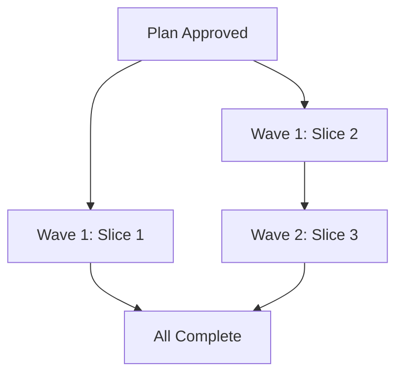

# Plan: Cart Styling and Product Accuracy

**Status**: implemented
**Created**: 2026-08-24
**Implemented**: 2026-08-26
**Gherkin persistence**: plan-file-only

## Goal

Fix three product page inaccuracies to ensure customers see correct, consistent information:
1. Standardize cart success message styling (green text) across collar and charm pages
2. Update shipping policy from multi-country to UK-only across all pages
3. Correct collar material description from "BioThane" to "PVC coated nylon webbing" across all pages

## Acceptance Criteria

**Scope:** All user-facing HTML files in `src/` and `src/content/` directories, excluding code comments and build artifacts. Requirements apply to all current and future product pages.

1. **Cart success message consistency**
   - Cart modal heading on collar.html uses #00AD50 (brand success green), identical to the computed color value of charms.html modal heading
   - All product type modals (collar, charms, and any future products) display success confirmation with #00AD50 text in the modal heading
   - Success confirmation includes both color and text content (✓ icon and "Added to Cart!" text) for non-visual accessibility

2. **Shipping policy accuracy**
   - Privacy policy states UK-only shipping (United Kingdom mainland)
   - FAQ shipping section lists only UK
   - Product pages (collar.html, charms.html, and any future product pages) contain no mentions of shipping to US, Canada, Australia, NZ, Ireland, or any country other than UK
   - Case-insensitive grep across all active HTML and Markdown content files in `src/` and `src/content/` finds no international shipping mentions (excluding code comments and disabled code)

3. **Material specification correctness**
   - FAQ primary material description (first mention) states "PVC coated nylon webbing" with all three properties: waterproof, durable, easy to clean
   - Size guide describes material as "PVC coated nylon webbing" (properties may be omitted if context is clear)
   - Product pages may reference material but must use "PVC coated nylon webbing" terminology (no property list required for product pages)
   - Case-insensitive grep for "biothane" across all active HTML and Markdown content files in `src/` and `src/content/` returns zero matches (excluding code comments and disabled code)

## Slices

### Slice 1: Standardize cart success modal styling

**Depends-on**: none

**Scenario: Cart success message displays in green for collars**

```gherkin
Feature: Cart Success Message Consistency

  Scenario: Adding collar shows green success confirmation
    Given I am on the collar product page
    When I select a size and color
    And I click "Add to Basket"
    Then I should see a modal with heading "✓ Added to Cart!"
    And the heading text should be green
    And the styling should match the charms success modal
```

**Steps**:

1. **Add green color styling to collar modal heading**
   - **Complexity**: trivial
   - **Files**: src/collar.html
   - **IMPLEMENT**: Add CSS rule `.modal-content h3 { color: #00AD50; }` to match charms.html success modal (brand success green #00AD50) for consistent user experience across product pages
   - **TEST**: Visual test - add collar to cart, verify heading is green (#00AD50)
   - **REFACTOR**: Check if modal styles can be consolidated; if yes, extract to common styles. Note: collar uses `.modal-content h3`, charms uses `.added-modal h2` - consider harmonizing class names

---

### Slice 2: Update shipping policy to UK-only

**Depends-on**: none

**Scenario: Shipping information reflects UK-only policy across all pages**

```gherkin
Feature: Shipping Policy Accuracy

  Scenario: Privacy policy shows UK-only shipping
    Given the privacy policy page has loaded successfully
    When I view the International Transfers section
    Then it should state "UK only" shipping
    And it should not mention other countries for shipping

  Scenario: FAQ shows UK-only shipping
    Given the FAQ page has loaded successfully
    When I view the shipping section
    Then it should list only United Kingdom
    And it should not list US, Canada, Australia, NZ, or Ireland for shipping

  Scenario: Product pages contain no conflicting shipping information
    Given the collar product page has loaded successfully
    When I view the entire page content
    Then it should not mention shipping to US, Canada, Australia, NZ, or Ireland
```

**Steps**:

1. **Update privacy policy shipping text**
   - **Complexity**: trivial
   - **Files**: src/privacy-policy.html, src/content/privacy-policy.md
   - **IMPLEMENT**: Change "We ship to UK, US, Canada, Australia, New Zealand, and Ireland" to "We currently ship to the UK only"
   - **TEST**: Read privacy-policy.html, verify International Transfers section says UK only
   - **REFACTOR**: none needed

2. **Update FAQ shipping section and verify product pages**
   - **Complexity**: trivial
   - **Files**: src/faq.html, src/collar.html (verification only), src/charms.html (verification only)
   - **IMPLEMENT**: Replace shipping country list with UK-only message in FAQ; update "worldwide" to "within the UK"
   - **TEST**: Read FAQ, verify "Where do you ship?" lists only UK; grep collar.html and charms.html to confirm no conflicting international shipping mentions
   - **REFACTOR**: none needed

---

### Slice 3: Correct material description

**Depends-on**: 2

**Scenario: Product material accurately described across all pages**

```gherkin
Feature: Material Specification Correctness

  Scenario: FAQ describes correct collar material with accurate properties
    Given the FAQ page has loaded successfully
    When I view the product materials section
    Then it should state "PVC coated nylon webbing"
    And it should list "waterproof" as a property
    And it should list "durable" as a property
    And it should list "easy to clean" as a property
    And it should not mention "BioThane" in any case variation

  Scenario: Size guide uses correct material terminology
    Given the size guide page has loaded successfully
    When I view the entire page content
    Then it should not mention "BioThane" in any case variation
    And if material is mentioned, it should use "PVC coated nylon webbing"

  Scenario: All BioThane variations removed site-wide
    Given I search all HTML and markdown source files
    When I perform a case-insensitive search
    Then I should find zero matches for "biothane"
    And I should find zero matches for "bio-thane"
```

**Steps**:

1. **Replace BioThane with PVC coated nylon webbing across all content files**
   - **Complexity**: trivial
   - **Files**: src/faq.html, src/content/faq.md, src/size-guide.html, src/content/size-guide.md
   - **IMPLEMENT**: Find all instances of "BioThane"/"biothane" (case-insensitive) in all 4 files (faq.html: 5 instances, faq.md: 6 instances, size-guide.html: 1 instance, size-guide.md: 1 instance), replace with "PVC coated nylon webbing". Note: Both .md and .html must be updated due to current content duplication architecture (no build process connects them).
   - **TEST**: Grep for "biothane" (case-insensitive) across src/ returns no matches; grep for "PVC coated nylon webbing" finds all material sections (FAQ and size guide)
   - **REFACTOR**: Verify material properties (waterproof, durable, easy to clean) are accurate for PVC-coated nylon. Add tech debt note about .md/.html content duplication requiring manual sync.

---

## Parallelization

Slices 1 and 2 can run concurrently (Wave 1). Slice 3 depends on Slice 2 completing first (Wave 2) to avoid collision on src/faq.html.



**Wave structure**:

| Wave | Slices | Files | Depends On |
|------|---------|-------|------------|
| 1 | 1, 2 | 1: src/collar.html<br>2: src/privacy-policy.html, src/content/privacy-policy.md, src/faq.html | none |
| 2 | 3 | 3: src/faq.html, src/content/faq.md, src/size-guide.html, src/content/size-guide.md | 2 |

**Collisions**: none - Slice 3's dependency on Slice 2 prevents concurrent edits to src/faq.html

**Scope notes**: Slice-level `**Files:**` declarations correctly specify all files each slice will modify.

---

## Approach Decisions

Per `/root/.claude/plugins/cache/bfinster/dev-team/12.5.0/knowledge/decision-defaults.md`:

- **Scope**: Touch only the three specified fixes (cart styling, shipping policy, material description). No expansion to adjacent issues.
- **Integration**: Standard PR workflow with auto-merge on green CI.

---

## Pre-PR Gate

- [ ] All acceptance criteria verified against live pages
- [ ] No mentions of "BioThane" remain (case-insensitive grep)
- [ ] Shipping sections across all pages state UK-only
- [ ] Cart modal green styling matches between collar and charms pages

---

## Skipped (low value)

None - all work items deliver user-visible accuracy fixes.

---

## Risks & Open Questions

**Risks**:
- Material properties list may need adjustment if PVC-coated nylon has different characteristics than BioThane
- Customers who previously saw international shipping may need communication about policy change
- **Content duplication architecture**: Privacy policy, FAQ, and size guide exist in both .md and .html formats with no build process connecting them, requiring manual synchronization

**Mitigations**:
- Review material properties during refactor step to ensure accuracy (waterproof, durable, easy to clean confirmed as correct for PVC-coated nylon)
- Document that this is a correction of previously incorrect information, not a policy change
- Update both .md and .html versions of affected files; add tech debt ticket to consolidate content architecture (either extend build process to generate HTML from markdown, or delete unused .md files)

---

## Build Progress

**Slice 1: Standardize cart success modal styling**
- [x] 1. Add green color styling to collar modal heading

**Slice 2: Update shipping policy to UK-only**
- [x] 1. Update privacy policy shipping text
- [x] 2. Update FAQ shipping section

**Slice 3: Correct material description**
- [x] 1. Replace BioThane with PVC coated nylon webbing across all content files

---

## Plan Review Summary

**Plan tier**: standard — 3 slices, 2 waves, all trivial steps, simple content/styling fixes

**Reviewers dispatched**: Acceptance Test Critic, Design & Architecture Critic, Parallelization Critic (UX skipped - no user journey changes)

**Review outcomes** (2 revision rounds):

**Round 1 findings** (all addressed in revision):
- **Acceptance (needs-revision)**: Vague test language ("properties should remain accurate"), incomplete scope (product pages not verified), concrete properties needed
- **Design (needs-revision)**: BioThane also in size-guide.html/md (not just FAQ), md/html duplication architecture needs acknowledgment
- **Parallelization (approve)**: All slices genuinely independent, safe concurrency

**Round 2 revisions applied**:
1. Expanded material change scope to include size-guide.html and size-guide.md (4 files total)
2. Made material properties scenario concrete (waterproof, durable, easy to clean)
3. Added product page verification scenarios for shipping and material
4. Acknowledged md/html content duplication architecture, added tech debt mitigation
5. Added design context for color choice (#00AD50 brand success green)
6. Created dependency: Slice 3 depends on Slice 2 to avoid src/faq.html collision

**Final status**: Ready for approval - all blocker findings addressed
