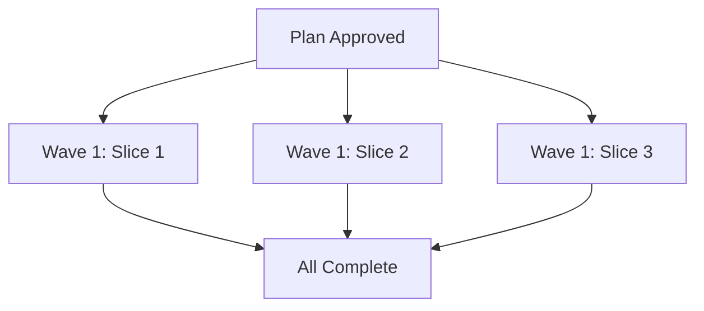

# Plan: Cart Styling and Product Accuracy

**Status**: draft
**Created**: 2026-08-24
**Gherkin persistence**: plan-file-only

## Goal

Fix three product page inaccuracies to ensure customers see correct, consistent information:
1. Standardize cart success message styling (green text) across collar and charm pages
2. Update shipping policy from multi-country to UK-only across all pages
3. Correct collar material description from "BioThane" to "PVC coated nylon webbing"

## Acceptance Criteria

1. **Cart success message consistency**
   - Cart modal heading is green on collar.html, matching charms.html
   - Visual confirmation uses same success color across all product types

2. **Shipping policy accuracy**
   - Privacy policy states UK-only shipping
   - FAQ shipping section lists only UK
   - No mentions of international shipping (US, Canada, Australia, NZ, Ireland)

3. **Material specification correctness**
   - FAQ material section describes "PVC coated nylon webbing"
   - No remaining mentions of "BioThane" or "biothane"
   - Material properties list remains accurate for the actual material

## Slices

### Slice 1: Standardize cart success modal styling

**Depends-on**: none

**Scenario: Cart success message displays in green for collars**

```gherkin
Feature: Cart Success Message Consistency

  Scenario: Adding collar shows green success confirmation
    Given I am on the collar product page
    When I select a size and color
    And I click "Add to Basket"
    Then I should see a modal with heading "✓ Added to Cart!"
    And the heading text should be green
    And the styling should match the charms success modal
```

**Steps**:

1. **Add green color styling to collar modal heading**
   - **Complexity**: trivial
   - **Files**: src/collar.html
   - **IMPLEMENT**: Add CSS rule `.modal-content h3 { color: #00AD50; }` or similar to match charms modal green
   - **TEST**: Visual test - add collar to cart, verify heading is green (#00AD50 or similar)
   - **REFACTOR**: Check if modal styles can be consolidated; if yes, extract to common styles

---

### Slice 2: Update shipping policy to UK-only

**Depends-on**: none

**Scenario: Shipping information reflects UK-only policy**

```gherkin
Feature: Shipping Policy Accuracy

  Scenario: Privacy policy shows UK-only shipping
    Given I navigate to the privacy policy page
    When I view the International Transfers section
    Then it should state "UK only" shipping
    And it should not mention other countries for shipping

  Scenario: FAQ shows UK-only shipping
    Given I navigate to the FAQ page
    When I view the shipping section
    Then it should list only United Kingdom
    And it should not list US, Canada, Australia, NZ, or Ireland for shipping
```

**Steps**:

1. **Update privacy policy shipping text**
   - **Complexity**: trivial
   - **Files**: src/privacy-policy.html, src/content/privacy-policy.md
   - **IMPLEMENT**: Change "We ship to UK, US, Canada, Australia, New Zealand, and Ireland" to "We currently ship to the UK only"
   - **TEST**: Read privacy-policy.html, verify International Transfers section says UK only
   - **REFACTOR**: none needed

2. **Update FAQ shipping section**
   - **Complexity**: trivial
   - **Files**: src/faq.html
   - **IMPLEMENT**: Replace shipping country list with UK-only message; update "worldwide" to "within the UK"
   - **TEST**: Read FAQ, verify "Where do you ship?" lists only UK
   - **REFACTOR**: none needed

---

### Slice 3: Correct material description

**Depends-on**: none

**Scenario: Product material accurately described**

```gherkin
Feature: Material Specification Correctness

  Scenario: FAQ describes correct collar material
    Given I navigate to the FAQ page
    When I view the product materials section
    Then it should state "PVC coated nylon webbing"
    And it should not mention "BioThane" or "biothane"
    And material properties should remain accurate

  Scenario: Material properties match PVC coated nylon webbing
    Given I navigate to the FAQ page  
    When I view the material properties list
    Then properties should be accurate for PVC coated nylon webbing
    And waterproof/durable claims should remain valid
```

**Steps**:

1. **Replace BioThane with PVC coated nylon webbing in FAQ**
   - **Complexity**: trivial
   - **Files**: src/faq.html
   - **IMPLEMENT**: Find all instances of "BioThane"/"biothane" (case-insensitive), replace with "PVC coated nylon webbing"
   - **TEST**: Grep for "biothane" (case-insensitive) returns no matches; grep for "PVC coated nylon webbing" finds FAQ material section
   - **REFACTOR**: Verify material properties list is still accurate for PVC-coated nylon (waterproof, durable, etc.)

---

## Parallelization

All three slices are independent (no file conflicts, no behavioral dependencies) and can execute concurrently.



**Wave structure**:

| Wave | Slices | Files | Depends On |
|------|---------|-------|------------|
| 1 | 1, 2, 3 | 1: src/collar.html<br>2: src/privacy-policy.html, src/content/privacy-policy.md<br>3: src/faq.html | none |

**Collisions**: none - all slices modify different files

**Scope notes**: Slice-level `**Files:**` declarations are over-declared (no per-step Files lines) but correctly specify all files each slice will modify.

---

## Approach Decisions

Per `/root/.claude/plugins/cache/bfinster/dev-team/12.5.0/knowledge/decision-defaults.md`:

- **Scope**: Touch only the three specified fixes (cart styling, shipping policy, material description). No expansion to adjacent issues.
- **Integration**: Standard PR workflow with auto-merge on green CI.

---

## Pre-PR Gate

- [ ] All acceptance criteria verified against live pages
- [ ] No mentions of "BioThane" remain (case-insensitive grep)
- [ ] Shipping sections across all pages state UK-only
- [ ] Cart modal green styling matches between collar and charms pages

---

## Skipped (low value)

None - all work items deliver user-visible accuracy fixes.

---

## Risks & Open Questions

**Risks**:
- Material properties list may need adjustment if PVC-coated nylon has different characteristics than BioThane
- Customers who previously saw international shipping may need communication about policy change

**Mitigations**:
- Review material properties during refactor step to ensure accuracy
- Document that this is a correction of previously incorrect information, not a policy change

---

## Build Progress

**Slice 1: Standardize cart success modal styling**
- [ ] 1. Add green color styling to collar modal heading

**Slice 2: Update shipping policy to UK-only**
- [ ] 1. Update privacy policy shipping text
- [ ] 2. Update FAQ shipping section

**Slice 3: Correct material description**
- [ ] 1. Replace BioThane with PVC coated nylon webbing in FAQ
