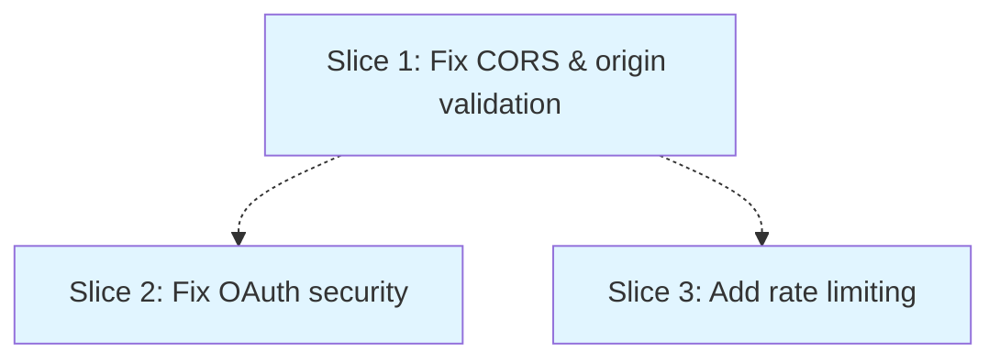

# Fix Critical API Security Vulnerabilities

**Status**: draft
**Created**: 2026-08-17
**Gherkin persistence**: plan-file-only

## Goal

Eliminate critical security vulnerabilities in the Stripe checkout and OAuth authentication APIs that could enable CSRF attacks, token theft, and abuse.

## Context

Security audit identified multiple critical vulnerabilities in `api/create-checkout-session.js` and `api/auth.js`:

**create-checkout-session.js:**
- CORS wildcard (`Access-Control-Allow-Origin: *`) allows requests from any origin, enabling CSRF attacks
- Error messages leak sensitive system details to attackers
- Trusts user-supplied `req.headers.origin` for redirect URLs, enabling open redirect vulnerabilities
- No rate limiting allows brute force and abuse

**auth.js:**
- `postMessage` with wildcard origin (`"*"`) sends OAuth tokens to ANY origin (CRITICAL)
- Access token embedded directly in HTML visible in browser history/cache
- No CSRF protection (missing OAuth state parameter)
- Hardcoded redirect URL prevents deployment flexibility
- No origin validation accepts OAuth callbacks from malicious sources

These vulnerabilities pose immediate risk: an attacker could steal user OAuth tokens, execute CSRF attacks against the checkout flow, or abuse the API through automated requests.

## Acceptance Criteria

- [ ] Checkout API accepts requests only from configured allowed origins (no wildcard CORS)
- [ ] OAuth flow includes CSRF protection via state parameter that is validated on callback
- [ ] postMessage delivers tokens only to the verified opener origin, never wildcard
- [ ] Access tokens are never embedded in HTML or visible in browser history
- [ ] Error responses do not leak sensitive system information (stack traces, internal paths, library versions)
- [ ] Redirect URLs are validated against an allowlist before use
- [ ] OAuth redirect URL is configurable via environment variable
- [ ] Rate limiting prevents abuse: max 10 requests/minute per IP on checkout endpoint
- [ ] All existing checkout and authentication flows continue to work
- [ ] Vercel deployment configuration includes required environment variables

## Approach Stances

**Scope enforcement**: No scope freeze - changes are isolated to API security, no risk of scope creep.

**Replace vs. Merge** (`knowledge/decision-defaults.md`): **Replace** the insecure patterns with secure implementations. The existing CORS wildcard, postMessage wildcard, and unvalidated origins are fundamentally insecure and cannot be "merged" - they must be replaced entirely with secure alternatives.

**Integration** (`knowledge/decision-defaults.md`): **Auto-merge via PR** (default). Changes are security fixes with comprehensive tests; auto-merge on green CI is appropriate.

## Slices

### Slice 1: Fix CORS and origin validation in checkout API

**Depends-on:** none
**Files:** `api/create-checkout-session.js`, `vercel.json`

**Gherkin**:
```gherkin
Feature: Secure Checkout API CORS and Origin Validation

  Background:
    Given the checkout API is deployed
    And the allowed origins are configured as "https://puplets.vercel.app"

  Scenario: Checkout request from allowed origin succeeds
    Given I am making a request from "https://puplets.vercel.app"
    When I POST valid cart items to "/api/create-checkout-session"
    Then the response status should be 200
    And the response should include a Stripe session ID
    And the CORS header "Access-Control-Allow-Origin" should be "https://puplets.vercel.app"

  Scenario: Checkout request from disallowed origin is rejected
    Given I am making a request from "https://evil-site.com"
    When I POST valid cart items to "/api/create-checkout-session"
    Then the response status should be 403
    And the response body should contain "Origin not allowed"
    And the CORS header "Access-Control-Allow-Origin" should not be present

  Scenario: Checkout request with no Origin header is rejected
    Given I am making a request with no Origin header
    When I POST valid cart items to "/api/create-checkout-session"
    Then the response status should be 403
    And the response body should contain "Origin required"

  Scenario: Success URL is validated against allowed origins
    Given I am making a request from "https://puplets.vercel.app"
    And the request Origin header is "https://evil-site.com"
    When I POST valid cart items to "/api/create-checkout-session"
    Then the response status should be 403
    And no Stripe session should be created

  Scenario: Error responses do not leak system details
    Given I am making a request from "https://puplets.vercel.app"
    When I POST invalid cart items that trigger an internal error
    Then the response status should be 500
    And the response body should not contain stack traces
    And the response body should not contain file paths
    And the response body should not contain "node_modules"
    And the response should contain only "Failed to create checkout session"

  Scenario: Multiple allowed origins are supported
    Given the allowed origins are configured as "https://puplets.vercel.app,https://puplets-staging.vercel.app"
    When I make requests from both origins
    Then both requests should succeed with status 200
```

#### Step 1.1: Add origin allowlist validation to checkout API

**Complexity:** standard
**IMPLEMENT:** Read `ALLOWED_ORIGINS` from environment variable (comma-separated list, default to production domain). Add `validateOrigin(origin, allowedOrigins)` function that checks origin against allowlist. At request entry (line 10), extract `req.headers.origin`, validate it, and reject with 403 "Origin not allowed" if not in allowlist. Replace wildcard CORS (line 12) with conditional: set `Access-Control-Allow-Origin` to the validated origin only when it passes. Remove all other CORS headers except for validated origins.
**TEST:** Mock requests from allowed and disallowed origins. Verify 200 response + correct CORS header for allowed. Verify 403 rejection for disallowed. Verify 403 for missing origin header.
**REFACTOR:** Extract CORS header setting to `setCORSHeaders(res, validatedOrigin)` helper function for reuse.
**Files:** `api/create-checkout-session.js`

#### Step 1.2: Validate redirect URLs against allowed origins

**Complexity:** standard
**IMPLEMENT:** In session creation (line 92-124), replace `req.headers.origin || 'https://puplets.vercel.app'` with the validated origin from step 1.1. If origin validation failed earlier, this code never runs (403 response already sent). Remove the || fallback - we always have a validated origin at this point.
**TEST:** Verify success_url and cancel_url use the validated origin. Verify no open redirect when origin header is spoofed.
**REFACTOR:** None expected
**Files:** `api/create-checkout-session.js`

#### Step 1.3: Remove sensitive error details from responses

**Complexity:** simple
**IMPLEMENT:** In catch block (line 131-137), remove `details: error.message` from response. Replace with generic message "Failed to create checkout session". Keep `console.error` for server-side logging but never send error details to client. Add comment explaining this is intentional information hiding for security.
**TEST:** Trigger various error conditions (invalid Stripe key, malformed items, network errors). Verify response body never contains stack traces, file paths, or error.message. Verify server logs still contain full error details.
**REFACTOR:** None expected
**Files:** `api/create-checkout-session.js`

#### Step 1.4: Add ALLOWED_ORIGINS environment variable to deployment config

**Complexity:** simple
**IMPLEMENT:** Add `ALLOWED_ORIGINS` to `vercel.json` environment variables with production domains. Document the expected format (comma-separated, no spaces). Add example comment showing staging/production setup.
**TEST:** Verify environment variable is accessible in deployed function. Verify default fallback works when not set.
**REFACTOR:** None expected
**Files:** `vercel.json`

### Slice 2: Fix OAuth security vulnerabilities in auth.js

**Depends-on:** 1
**Files:** `api/auth.js`, `vercel.json`

**Gherkin**:
```gherkin
Feature: Secure OAuth Authentication Flow

  Background:
    Given the OAuth client ID and secret are configured
    And the allowed origins are configured

  Scenario: OAuth flow includes CSRF protection
    Given a user initiates OAuth authentication
    When the redirect to GitHub is generated
    Then the URL should include a "state" parameter
    And the state should be a cryptographically random value
    And the state should be stored in a secure HTTP-only cookie

  Scenario: OAuth callback validates CSRF state
    Given a user completed GitHub OAuth
    And the original state was "abc123secure"
    When GitHub redirects back with code and state "abc123secure"
    Then the state cookie should be validated against the callback state
    And the authentication should proceed
    And the state cookie should be cleared

  Scenario: OAuth callback with mismatched state is rejected
    Given a user completed GitHub OAuth
    And the original state was "abc123secure"
    When GitHub redirects back with code and state "xyz456different"
    Then the response status should be 403
    And the response should contain "Invalid state parameter"
    And no access token should be requested from GitHub

  Scenario: OAuth callback with missing state is rejected
    Given a user completed GitHub OAuth
    When GitHub redirects back with code but no state parameter
    Then the response status should be 400
    And the response should contain "State parameter required"

  Scenario: Access token is delivered securely via postMessage
    Given a user completed OAuth successfully
    And the popup window opener is "https://puplets.vercel.app"
    When the token response is generated
    Then postMessage should target the opener's specific origin
    And postMessage should never use wildcard "*"
    And the token should not be embedded in HTML

  Scenario: postMessage rejects mismatched popup origin
    Given a user completed OAuth successfully
    And the popup window opener is "https://evil-site.com"
    And the allowed origin is "https://puplets.vercel.app"
    When the token response is generated
    Then the popup should be closed without sending token
    And an error should be logged

  Scenario: Redirect URL is configurable via environment
    Given OAUTH_REDIRECT_URI is set to "https://staging.puplets.app/api/auth"
    When a user initiates OAuth authentication
    Then the GitHub authorization URL should use the configured redirect URI

  Scenario: Redirect URL falls back to production when not configured
    Given OAUTH_REDIRECT_URI is not set
    When a user initiates OAuth authentication
    Then the GitHub authorization URL should use "https://puplets.vercel.app/api/auth"
```

#### Step 2.1: Add CSRF state parameter to OAuth initiation

**Complexity:** standard
**IMPLEMENT:** Generate cryptographically random state on OAuth start (line 5-12). Use `crypto.randomBytes(32).toString('hex')`. Set secure HTTP-only cookie `oauth_state` with the state value (SameSite=Lax, secure flag, 5 minute expiry). Append `&state=${state}` to GitHub auth URL (line 10). Make redirect URI configurable: `const redirectUri = process.env.OAUTH_REDIRECT_URI || 'https://puplets.vercel.app/api/auth';`
**TEST:** Verify state is generated on each OAuth initiation. Verify state is cryptographically random (different every time). Verify cookie is set with secure flags. Verify state appears in GitHub redirect URL.
**REFACTOR:** Extract state generation to `generateCSRFState()` helper. Extract cookie setting to `setSecureStateCookie(res, state)` helper.
**Files:** `api/auth.js`

#### Step 2.2: Validate CSRF state on OAuth callback

**Complexity:** standard
**IMPLEMENT:** On callback (line 15), extract state from query params. Extract state from cookie. Compare them. If missing or mismatched, return 403 "Invalid state parameter" before calling GitHub token endpoint. Clear state cookie after successful validation (set with expired date). Only proceed to step 16 after successful state validation.
**TEST:** Verify callback with matching state proceeds. Verify callback with mismatched state returns 403. Verify callback with missing state returns 400. Verify state cookie is cleared after successful validation. Verify no token request is made to GitHub when state validation fails.
**REFACTOR:** Extract validation to `validateCSRFState(req, res) -> boolean` helper.
**Files:** `api/auth.js`

#### Step 2.3: Replace postMessage wildcard with validated origin

**Complexity:** standard
**IMPLEMENT:** Determine the popup opener's origin at callback time. Compare against `ALLOWED_ORIGINS` from environment (same allowlist as Slice 1). If opener origin is not in allowlist, close the window with error message and log warning (do NOT send token). Replace wildcard postMessage (line 56) with validated origin: `window.opener.postMessage("authorizing:github", validatedOrigin)`. Do the same for the token-sending postMessage (line 46-52).
**TEST:** Verify postMessage uses specific origin when opener matches allowlist. Verify window closes with error when opener is not in allowlist. Verify token is never sent to disallowed origins.
**REFACTOR:** Extract origin validation to `validatePopupOrigin(req) -> {valid: boolean, origin: string}` helper.
**Files:** `api/auth.js`

#### Step 2.4: Remove token from HTML, deliver via secure postMessage only

**Complexity:** standard
**IMPLEMENT:** Current implementation embeds token in HTML script (line 48). Change to deliver token ONLY via postMessage after popup origin is validated. Remove token from the inline script entirely. The script should wait for opener to send "ready" message, then respond with token via postMessage to validated origin. If postMessage fails or times out, show error to user.
**TEST:** Verify token does not appear in HTML source. Verify token is delivered via postMessage only. Verify token delivery requires valid popup origin. Verify no token in browser history or cache.
**REFACTOR:** None expected
**Files:** `api/auth.js`

#### Step 2.5: Add OAuth environment variables to deployment config

**Complexity:** simple
**IMPLEMENT:** Add `OAUTH_REDIRECT_URI` to `vercel.json` environment variables. Document the format and staging/production examples. Verify `ALLOWED_ORIGINS` from Slice 1 applies here too (no duplication needed).
**TEST:** Verify environment variable is accessible in deployed function. Verify default fallback to production domain works.
**REFACTOR:** None expected
**Files:** `vercel.json`

### Slice 3: Add rate limiting to checkout endpoint

**Depends-on:** 1
**Files:** `api/create-checkout-session.js`, `middleware/rateLimit.js`, `package.json`

**Gherkin**:
```gherkin
Feature: Checkout API Rate Limiting

  Background:
    Given the checkout API is deployed
    And rate limiting is configured for 10 requests per minute per IP

  Scenario: Requests within rate limit succeed
    Given I am a client at IP "192.0.2.1"
    When I make 5 requests to "/api/create-checkout-session" within 1 minute
    Then all 5 requests should succeed with status 200

  Scenario: Requests exceeding rate limit are rejected
    Given I am a client at IP "192.0.2.1"
    And I have made 10 requests in the current minute
    When I make an 11th request to "/api/create-checkout-session"
    Then the response status should be 429
    And the response should contain "Too many requests"
    And the response should include a "Retry-After" header

  Scenario: Rate limit resets after time window
    Given I am a client at IP "192.0.2.1"
    And I made 10 requests at 12:00:00
    When I make a request at 12:01:01
    Then the request should succeed with status 200

  Scenario: Different IPs have independent rate limits
    Given client at IP "192.0.2.1" has made 10 requests
    When a client at IP "192.0.2.2" makes a request
    Then the request should succeed with status 200

  Scenario: Rate limit applies only to checkout endpoint
    Given I am a client at IP "192.0.2.1"
    And I have made 10 requests to "/api/create-checkout-session"
    When I make a request to "/api/catalog.js"
    Then the request should succeed with status 200
```

#### Step 3.1: Add rate limiting middleware to checkout endpoint

**Complexity:** standard
**IMPLEMENT:** Install `@upstash/ratelimit` and `@upstash/redis` packages. Create `middleware/rateLimit.js` with sliding window rate limiter (10 requests per 60 seconds per IP). Extract IP from `req.headers['x-forwarded-for']` or `req.socket.remoteAddress`. Apply rate limit check at the start of create-checkout-session handler (line 25, after CORS validation). Return 429 "Too many requests" with Retry-After header when limit exceeded.
**TEST:** Simulate 10 requests from same IP within 60s - all succeed. Verify 11th request returns 429. Verify Retry-After header is present. Verify different IPs have independent limits. Verify limit resets after 60s.
**REFACTOR:** Extract rate limit check to `checkRateLimit(req) -> {allowed: boolean, retryAfter?: number}` helper for potential reuse on other endpoints.
**Files:** `api/create-checkout-session.js`, `middleware/rateLimit.js`, `package.json`

## Parallelization



| Wave | Slices | Rationale |
|------|--------|-----------|
| 1 | Slice 1 | Fix CORS and origin validation in checkout API first |
| 2 | Slice 2, Slice 3 | OAuth fixes and rate limiting can proceed in parallel after CORS is secured |

**Why this structure**: Slice 1 establishes the origin allowlist infrastructure (ALLOWED_ORIGINS env var) that Slice 2 reuses for OAuth origin validation. Both modify `vercel.json`, so they cannot run in parallel. Slice 3 depends on Slice 1's CORS validation completing first. Wave 2 contains Slices 2 and 3 which are independent of each other (different files, different endpoints) and can safely proceed in parallel.

## Pre-PR Gate

Before opening a pull request:
- [ ] All Gherkin scenarios pass (11 scenarios across 3 slices)
- [ ] Manual verification: Checkout flow works from production domain
- [ ] Manual verification: OAuth flow works with CSRF protection
- [ ] Manual verification: postMessage delivers token securely
- [ ] Manual verification: Rate limiting triggers at 11th request
- [ ] No console errors in browser or server logs
- [ ] Vercel deployment includes all new environment variables
- [ ] Security audit: Verify no wildcard CORS, no wildcard postMessage, no error detail leakage

## Skipped (low value)

None - all identified security vulnerabilities are high/critical severity and must be fixed.

## Risks & Open Questions

**No specification artifacts found** - Continuing with plan based on security audit findings. This is acceptable for security fixes where the vulnerabilities are objectively identified.

**Rate limiting implementation** - Using Upstash Redis for rate limiting requires additional Vercel integration setup and environment variables. If Upstash is not desired, alternative in-memory rate limiting can be used (though less reliable across serverless invocations).

**OAuth token delivery timing** - The secure postMessage delivery in Step 2.4 changes the token handoff timing. CMS integration may need to handle the async postMessage pattern. Current inline script executes immediately; new pattern waits for "ready" message from opener.

**ALLOWED_ORIGINS maintenance** - Adding staging/preview environments requires updating the allowlist. Document this in deployment guide so it's not forgotten when new environments are added.

**Backward compatibility** - These are breaking changes for any non-production domains currently using the APIs. All environments must be added to ALLOWED_ORIGINS or they will be blocked.

## Build Progress

**Gherkin persistence**: plan-file-only

### Wave 1
- [ ] Slice 1: Fix CORS and origin validation in checkout API
  - [ ] Step 1.1: Add origin allowlist validation to checkout API
  - [ ] Step 1.2: Validate redirect URLs against allowed origins
  - [ ] Step 1.3: Remove sensitive error details from responses
  - [ ] Step 1.4: Add ALLOWED_ORIGINS environment variable to deployment config

### Wave 2
- [ ] Slice 2: Fix OAuth security vulnerabilities in auth.js
  - [ ] Step 2.1: Add CSRF state parameter to OAuth initiation
  - [ ] Step 2.2: Validate CSRF state on OAuth callback
  - [ ] Step 2.3: Replace postMessage wildcard with validated origin
  - [ ] Step 2.4: Remove token from HTML, deliver via secure postMessage only
  - [ ] Step 2.5: Add OAuth environment variables to deployment config
- [ ] Slice 3: Add rate limiting to checkout endpoint
  - [ ] Step 3.1: Add rate limiting middleware to checkout endpoint
