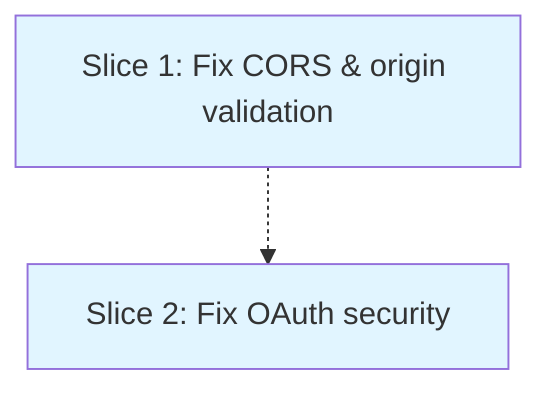

# Fix Critical API Security Vulnerabilities

**Status**: approved
**Created**: 2026-08-17
**Approved**: 2026-08-17
**Gherkin persistence**: plan-file-only

## Goal

Eliminate critical security vulnerabilities in the Stripe checkout and OAuth authentication APIs that could enable CSRF attacks, token theft, and abuse.

## Context

Security audit identified multiple critical vulnerabilities in `api/create-checkout-session.js` and `api/auth.js`:

**create-checkout-session.js:**
- CORS wildcard (`Access-Control-Allow-Origin: *`) allows requests from any origin, enabling CSRF attacks
- Error messages leak sensitive system details to attackers
- Trusts user-supplied `req.headers.origin` for redirect URLs, enabling open redirect vulnerabilities
- No rate limiting allows brute force and abuse

**auth.js:**
- `postMessage` with wildcard origin (`"*"`) sends OAuth tokens to ANY origin (CRITICAL)
- Access token embedded directly in HTML visible in browser history/cache
- No CSRF protection (missing OAuth state parameter)
- Hardcoded redirect URL prevents deployment flexibility
- No origin validation accepts OAuth callbacks from malicious sources

These vulnerabilities pose immediate risk: an attacker could steal user OAuth tokens, execute CSRF attacks against the checkout flow, or abuse the API through automated requests.

## Acceptance Criteria

- [ ] Checkout API accepts requests only from configured allowed origins (no wildcard CORS) - verified by making request from unlisted origin and receiving 403
- [ ] OAuth flow includes CSRF protection via cryptographically random state parameter (minimum 32 bytes), stored in HTTP-only cookie named oauth_state with SameSite=Lax, Secure flag, and 5-minute expiry - validated on callback by comparing cookie value with callback parameter - cookie must be present and unexpired at callback or validation fails - cookie is cleared (set with expired date) after successful validation
- [ ] OAuth callback with invalid or missing state parameter renders HTML error popup displaying "Authentication failed. Please try again." without requesting access token from GitHub - state validation failures are logged as security events
- [ ] postMessage delivers tokens only to the verified opener origin, never wildcard - verified by origin validation before message send
- [ ] OAuth callback page embeds access token in HTML response for Decap CMS compatibility, then validates popup opener origin against ALLOWED_ORIGINS list (same as checkout API) - if origin is valid, token is sent via postMessage to that specific validated origin only (never wildcard) - if origin is invalid, popup displays error message per criterion 13 and token is not sent
- [ ] Error responses do not leak sensitive system information (stack traces, internal paths, library versions) in response body or headers - verified by triggering errors and inspecting responses - server-side logs may contain full error details for debugging
- [ ] Redirect URLs use only the validated request origin - any user-supplied success_url path is ignored and replaced with {validated_origin}/success.html?session_id={CHECKOUT_SESSION_ID}
- [ ] OAuth redirect URL is configurable via environment variable
- [ ] Authenticated users can complete checkout from allowed origins with valid cart items and receive a Stripe session URL
- [ ] Users can authenticate via GitHub OAuth from allowed origins and receive an access token via postMessage
- [ ] Vercel deployment configuration includes ALLOWED_ORIGINS (comma-separated) and OAUTH_REDIRECT_URI environment variables with documented examples
- [ ] ALLOWED_ORIGINS environment variable is comma-separated list including https://puplets.vercel.app (production) and https://puplets-staging.vercel.app (staging) - simple wildcard matching supports https://puplets-*.vercel.app for preview deployments where * matches any valid subdomain characters - malformed ALLOWED_ORIGINS causes server to return 500 to all requests - deployment documentation includes concrete examples for production/staging/preview configuration
- [ ] OAuth popup origin validation failure displays error message to user: "Authentication failed due to a security policy. Please try again or contact support."
- [ ] Requests from disallowed origins receive user-friendly error: "This request cannot be completed. Please contact support." (not technical "origin not allowed")

## Approach Stances

**Scope enforcement**: No scope freeze - changes are isolated to API security, no risk of scope creep.

**Replace vs. Merge** (`knowledge/decision-defaults.md`): **Replace** the insecure patterns with secure implementations. The existing CORS wildcard, postMessage wildcard, and unvalidated origins are fundamentally insecure and cannot be "merged" - they must be replaced entirely with secure alternatives.

**Integration** (`knowledge/decision-defaults.md`): **Auto-merge via PR** (default). Changes are security fixes with comprehensive tests; auto-merge on green CI is appropriate.

## Slices

### Slice 1: Fix CORS and origin validation in checkout API

**Depends-on:** none
**Files:** `api/security-utils.js`, `tests/security-utils.test.js`, `api/create-checkout-session.js`, `vercel.json`

**Gherkin**:
```gherkin
Feature: Secure Checkout API CORS and Origin Validation

  Background:
    Given the checkout API is deployed
    And the allowed origins are configured as "https://puplets.vercel.app"

  Scenario: Checkout request from allowed origin succeeds
    Given I am making a request from "https://puplets.vercel.app"
    When I POST valid cart items to "/api/create-checkout-session"
    Then the response status should be 200
    And the response should include a Stripe session ID
    And the CORS header "Access-Control-Allow-Origin" should be "https://puplets.vercel.app"

  Scenario: Checkout request from disallowed origin is rejected
    Given I am making a request from "https://evil-site.com"
    When I POST valid cart items to "/api/create-checkout-session"
    Then the response status should be 403
    And the response body should contain "This request cannot be completed. Please contact support."
    And the CORS header "Access-Control-Allow-Origin" should not be present

  Scenario: Checkout request with no Origin header is rejected
    Given I am making a request with no Origin header
    When I POST valid cart items to "/api/create-checkout-session"
    Then the response status should be 403
    And the response body should contain "This request cannot be completed. Please contact support."

  Scenario: Success URL must match validated origin
    Given the allowed origins are configured as "https://puplets.vercel.app"
    And I am making a request from "https://puplets.vercel.app"
    When I POST valid cart items with success_url "https://evil-site.com/success"
    Then the response status should be 200
    And the Stripe session success_url should be "https://puplets.vercel.app/success.html?session_id={CHECKOUT_SESSION_ID}"
    And the Stripe session success_url should not contain "evil-site.com"

  Scenario: Error responses do not leak system details
    Given I am making a request from "https://puplets.vercel.app"
    And the Stripe API is unavailable (mocked to return 500)
    When I POST valid cart items to "/api/create-checkout-session"
    Then the response status should be 500
    And the response body should not contain stack traces
    And the response body should not contain file paths
    And the response body should not contain "node_modules"
    And the response body should contain "Failed to create checkout session"
    And the server logs should contain the full error details for debugging

  Scenario: Multiple allowed origins are supported
    Given the allowed origins are configured as "https://puplets.vercel.app,https://puplets-staging.vercel.app"
    When I make requests from both origins
    Then both requests should succeed with status 200

  Scenario: Empty ALLOWED_ORIGINS is rejected
    Given the ALLOWED_ORIGINS environment variable is set to ""
    When I POST valid cart items from "https://puplets.vercel.app"
    Then the response status should be 403
    And the response body should contain "This request cannot be completed. Please contact support."

  Scenario: Malformed or missing ALLOWED_ORIGINS fails closed
    Given the ALLOWED_ORIGINS environment variable is malformed or unset
    When I POST valid cart items from "https://puplets.vercel.app"
    Then the response status should be 500
    And the response body should contain "Server configuration error"
    And the server logs should alert "ALLOWED_ORIGINS not configured or malformed"

  Scenario: ALLOWED_ORIGINS with whitespace is normalized
    Given the ALLOWED_ORIGINS environment variable is "https://puplets.vercel.app, https://puplets-staging.vercel.app"
    When I POST valid cart items from "https://puplets-staging.vercel.app"
    Then the response status should be 200
    And the request should succeed despite whitespace in configuration

  Scenario: CORS preflight from allowed origin succeeds
    Given I am making a preflight OPTIONS request from "https://puplets.vercel.app"
    When I request "/api/create-checkout-session" with Access-Control-Request-Method: POST
    Then the response status should be 200
    And Access-Control-Allow-Origin should be "https://puplets.vercel.app"
    And Access-Control-Allow-Methods should include POST
```

#### Step 1.0: Create shared security validation module

**Complexity:** simple
**IMPLEMENT:** Create `api/security-utils.js` exporting shared security functions that both APIs will use:
- `parseAllowedOrigins(envVar)`: Parse comma-separated ALLOWED_ORIGINS, trim whitespace, validate format. Return array or throw if malformed/empty.
- `validateOrigin(origin, allowedOrigins)`: Check if origin is in allowlist. Return { valid: boolean, origin: string }.
- `setCORSHeaders(res, validatedOrigin)`: Set CORS headers for validated origin only.
Add unit tests in `tests/security-utils.test.js` covering: valid/invalid/malformed origins, empty/malformed ALLOWED_ORIGINS, whitespace handling.
**TEST:** Unit tests verify: parseAllowedOrigins with valid/empty/malformed env vars; validateOrigin with allowed/disallowed/missing origins; setCORSHeaders sets correct headers.
**REFACTOR:** None (new file)
**Files:** `api/security-utils.js`, `tests/security-utils.test.js`

#### Step 1.1: Add origin allowlist validation to checkout API

**Complexity:** standard
**IMPLEMENT:** Import `{ parseAllowedOrigins, validateOrigin, setCORSHeaders }` from `./security-utils.js`. Read `ALLOWED_ORIGINS` from environment variable using `parseAllowedOrigins()` - if it throws (malformed/empty), return 500 "Server configuration error" and log alert. At request entry (line 10), extract `req.headers.origin`, validate using `validateOrigin()`, and reject with 403 "This request cannot be completed. Please contact support." if not valid. Replace wildcard CORS (line 12) with `setCORSHeaders(res, validatedOrigin)`.
**TEST:** Mock requests from allowed and disallowed origins. Verify 200 response + correct CORS header for allowed. Verify 403 rejection for disallowed with user-friendly message. Verify 403 for missing origin header. Verify 500 for malformed ALLOWED_ORIGINS.
**REFACTOR:** None (already using shared module)
**Files:** `api/create-checkout-session.js`

#### Step 1.2: Validate redirect URLs against allowed origins

**Complexity:** standard
**IMPLEMENT:** In session creation (line 92-124), replace `req.headers.origin || 'https://puplets.vercel.app'` with the validated origin from step 1.1. If origin validation failed earlier, this code never runs (403 response already sent). Remove the || fallback - we always have a validated origin at this point.
**TEST:** Verify success_url and cancel_url use the validated origin. Verify no open redirect when origin header is spoofed.
**REFACTOR:** None expected
**Files:** `api/create-checkout-session.js`

#### Step 1.3: Remove sensitive error details from responses

**Complexity:** simple
**IMPLEMENT:** In catch block (line 131-137), remove `details: error.message` from response. Replace with generic message "Failed to create checkout session". Keep `console.error` for server-side logging but never send error details to client. Add comment explaining this is intentional information hiding for security.
**TEST:** Trigger various error conditions (invalid Stripe key, malformed items, network errors). Verify response body never contains stack traces, file paths, or error.message. Verify server logs still contain full error details.
**REFACTOR:** None expected
**Files:** `api/create-checkout-session.js`

#### Step 1.4: Add ALLOWED_ORIGINS environment variable to deployment config

**Complexity:** simple
**IMPLEMENT:** Add `ALLOWED_ORIGINS` to `vercel.json` environment variables with production domains. Document the expected format (comma-separated, no spaces, no trailing commas). Add example comment showing staging/production setup. This is REQUIRED - the API will return 500 if not configured.
**TEST:** Verify environment variable is accessible in deployed function. Verify 500 error response when ALLOWED_ORIGINS is malformed or missing.
**REFACTOR:** None expected
**Files:** `vercel.json`

### Slice 2: Fix OAuth security vulnerabilities in auth.js

**Depends-on:** 1
**Files:** `api/auth.js`, `vercel.json`

**Gherkin**:
```gherkin
Feature: Secure OAuth Authentication Flow

  Background:
    Given the OAuth client ID and secret are configured
    And the allowed origins are configured

  Scenario: OAuth flow includes CSRF protection
    Given a user initiates OAuth authentication
    When the redirect to GitHub is generated
    Then the URL should include a "state" parameter
    And the state should be a cryptographically random value
    And the state should be stored in a secure HTTP-only cookie

  Scenario: OAuth callback validates CSRF state
    Given a user completed GitHub OAuth
    And the original state was "abc123secure"
    When GitHub redirects back with code and state "abc123secure"
    Then the state cookie should be validated against the callback state
    And the authentication should proceed
    And the state cookie should be cleared

  Scenario: OAuth callback with mismatched state is rejected
    Given a user completed GitHub OAuth
    And the original state was "abc123secure"
    When GitHub redirects back with code and state "xyz456different"
    Then the popup should display "Authentication failed. Please try again."
    And no access token should be requested from GitHub

  Scenario: OAuth callback with missing state is rejected
    Given a user completed GitHub OAuth
    When GitHub redirects back with code but no state parameter
    Then the popup should display "Authentication failed. Please try again."
    And no access token should be requested from GitHub

  Scenario: Access token is delivered securely via postMessage
    Given a user completed OAuth successfully
    And the popup window opener is "https://puplets.vercel.app"
    When the token response is generated
    Then postMessage should target the opener's specific origin "https://puplets.vercel.app"
    And postMessage should never use wildcard "*"
    And the token should be sent only to the validated origin

  Scenario: postMessage rejects mismatched popup origin
    Given a user completed OAuth successfully
    And the popup window opener is "https://evil-site.com"
    And the allowed origin is "https://puplets.vercel.app"
    When the token response is generated
    Then the popup should display "Authentication failed due to a security policy. Please try again or contact support."
    And no postMessage should be sent
    And an error should be logged

  Scenario: Redirect URL is configurable via environment
    Given OAUTH_REDIRECT_URI is set to "https://staging.puplets.app/api/auth"
    When a user initiates OAuth authentication
    Then the GitHub authorization URL should use the configured redirect URI

  Scenario: Redirect URL falls back to production when not configured
    Given OAUTH_REDIRECT_URI is not set
    When a user initiates OAuth authentication
    Then the GitHub authorization URL should use "https://puplets.vercel.app/api/auth"

  Scenario: User denies GitHub OAuth permission
    Given a user initiated OAuth authentication
    When GitHub redirects back with error=access_denied
    Then the popup should display "Authentication was cancelled"
    And no access token should be requested from GitHub
    And the popup should close after displaying the message
```

#### Step 2.1: Add CSRF state parameter to OAuth initiation

**Complexity:** standard
**IMPLEMENT:** Generate cryptographically random state on OAuth start (line 5-12). Use `crypto.randomBytes(32).toString('hex')`. Set secure HTTP-only cookie `oauth_state` with the state value (SameSite=Lax, secure flag, 5 minute expiry). Append `&state=${state}` to GitHub auth URL (line 10). Make redirect URI configurable: `const redirectUri = process.env.OAUTH_REDIRECT_URI || 'https://puplets.vercel.app/api/auth';`
**TEST:** Verify state is generated on each OAuth initiation. Verify state is cryptographically random (different every time). Verify cookie is set with secure flags. Verify state appears in GitHub redirect URL.
**REFACTOR:** Extract state generation to `generateCSRFState()` helper. Extract cookie setting to `setSecureStateCookie(res, state)` helper.
**Files:** `api/auth.js`

#### Step 2.2: Validate CSRF state on OAuth callback

**Complexity:** standard
**IMPLEMENT:** On callback (line 15), extract state from query params. Extract state from cookie. Compare them. If missing or mismatched, render HTML popup displaying "Authentication failed. Please try again." with semantic HTML structure (h1 heading, p for message, role="alert" for accessibility). Do NOT call GitHub token endpoint if state validation fails. Clear state cookie after successful validation (set with expired date). Only proceed to token exchange after successful state validation.
**TEST:** Verify callback with matching state proceeds. Verify callback with mismatched/missing state displays user-friendly HTML error in popup (not bare HTTP response). Verify state cookie is cleared after successful validation. Verify no token request is made to GitHub when state validation fails.
**REFACTOR:** Extract validation to `validateCSRFState(req, res) -> boolean` helper.
**Files:** `api/auth.js`

#### Step 2.3: Validate popup origin and replace postMessage wildcard

**Complexity:** standard
**IMPLEMENT:** Server-side: Import `{ parseAllowedOrigins }` from `./security-utils.js`. Parse ALLOWED_ORIGINS using `parseAllowedOrigins()` (fail with 500 if malformed). Inject the parsed allowlist into the client-side script as a JavaScript constant. Client-side: In the `receiveMessage(e)` function (line 45), validate `e.origin` against the injected allowlist before sending the token. If `e.origin` is not in the allowlist, display user-friendly error in the popup: "Authentication failed due to a security policy. Please try again or contact support." and do NOT send postMessage. If `e.origin` is valid, replace wildcard in both postMessage calls (lines 46-52, 56) with `e.origin`. Token remains in response HTML for Decap CMS compatibility but is only sent via postMessage to validated origins.
**TEST:** Verify postMessage uses specific validated origin, never wildcard. Verify popup from disallowed origin shows error message and does not send token. Verify popup from allowed origin completes successfully with token via postMessage to that specific origin. Verify Decap CMS integration still works (no protocol changes).
**REFACTOR:** Extract client-side validation logic into a testable function if it grows beyond 10 lines.
**Files:** `api/auth.js`

#### Step 2.4: Add OAuth environment variables to deployment config

**Complexity:** simple
**IMPLEMENT:** Add `OAUTH_REDIRECT_URI` to `vercel.json` environment variables. Document the format and staging/production examples. Verify `ALLOWED_ORIGINS` from Slice 1 applies here too (no duplication needed).
**TEST:** Verify environment variable is accessible in deployed function. Verify default fallback to production domain works.
**REFACTOR:** None expected
**Files:** `vercel.json`


## Parallelization



| Wave | Slices | Rationale |
|------|--------|-----------|
| 1 | Slice 1 | Fix CORS and origin validation in checkout API first |
| 2 | Slice 2 | OAuth fixes after CORS infrastructure is established |

**Why this structure**: Slice 1 establishes the origin allowlist infrastructure (ALLOWED_ORIGINS env var) that Slice 2 reuses for OAuth origin validation. Both modify `vercel.json`, so they must run sequentially. This 2-slice plan focuses on the CRITICAL vulnerabilities (CSRF, token theft, CORS wildcard, information leakage). Rate limiting (abuse prevention, not a vulnerability enabling data theft) is deferred to a follow-up plan.

## Pre-PR Gate

Before opening a pull request:
- [ ] All Gherkin scenarios pass (16 scenarios across 2 slices)
- [ ] All unit tests pass (security-utils.test.js)
- [ ] Manual verification: Checkout flow works from production domain
- [ ] Manual verification: OAuth flow works with CSRF protection
- [ ] Manual verification: postMessage delivers token securely to allowed origins only
- [ ] No console errors in browser or server logs
- [ ] Vercel deployment includes all new environment variables
- [ ] Security audit: Verify no wildcard CORS, no wildcard postMessage, no error detail leakage

## Skipped (low value)

**Rate limiting** - Deferred to separate follow-up plan. While abuse prevention is valuable, rate limiting is not a vulnerability that enables direct data theft or token compromise. This plan focuses on CRITICAL vulnerabilities (CSRF, token theft, CORS wildcard, information leakage) only.

## Risks & Open Questions

**No specification artifacts found** - Continuing with plan based on security audit findings. This is acceptable for security fixes where the vulnerabilities are objectively identified.

**ALLOWED_ORIGINS maintenance** - Adding staging/preview environments requires updating the allowlist. Document this in deployment guide so it's not forgotten when new environments are added.

**Backward compatibility** - These are breaking changes for any non-production domains currently using the APIs. All environments must be added to ALLOWED_ORIGINS or they will be blocked.

## Build Progress

**Gherkin persistence**: plan-file-only

### Wave 1
- [ ] Slice 1: Fix CORS and origin validation in checkout API
  - [x] Step 1.0: Create shared security validation module
  - [x] Step 1.1: Add origin allowlist validation to checkout API
  - [x] Step 1.2: Validate redirect URLs against allowed origins
  - [x] Step 1.3: Remove sensitive error details from responses
  - [ ] Step 1.4: Add ALLOWED_ORIGINS environment variable to deployment config

### Wave 2
- [ ] Slice 2: Fix OAuth security vulnerabilities in auth.js
  - [ ] Step 2.1: Add CSRF state parameter to OAuth initiation
  - [ ] Step 2.2: Validate CSRF state on OAuth callback
  - [ ] Step 2.3: Validate popup origin and replace postMessage wildcard
  - [ ] Step 2.4: Add OAuth environment variables to deployment config
