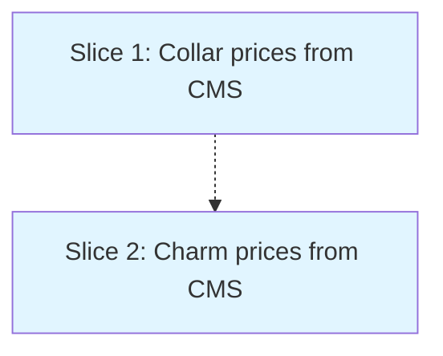

# Make Product Prices CMS-Editable

**Status**: approved  
**Created**: 2026-08-15  
**Gherkin persistence**: plan-file-only

## Goal

Replace hardcoded product prices in collar.html and charms.html with prices loaded from existing CMS-editable product data files, making prices editable via the admin panel without code changes.

## Context

Product data files already exist with price information:
- `src/products/collars/waterproof-collar.json` contains `sizes` array with per-size prices
- `src/products/charms/individual-charms.json` contains a `price` field

However, the frontend pages still use hardcoded prices:
- `collar.html` line 706: `const prices = { xs: 17.99, s: 17.99, m: 20.99 };`
- `charms.html` line 332: `const charmPrice = 3.99;`

The CMS admin schema (src/admin/index.html) already defines these collections with price widgets, so the editing infrastructure exists - we just need to connect the frontend to it.

## Acceptance Criteria

- [ ] Collar page displays distinct prices for XS (£17.99), S (£17.99), and M (£20.99) sizes that match current CMS product data
- [ ] Charm page displays price (£3.99) that matches current CMS product data
- [ ] When CMS data loads successfully, all prices from CMS are displayed within 1 second of DOMContentLoaded event
- [ ] When product data cannot be loaded (network error, timeout, 404), page displays fallback prices (collar XS/S: £17.99, M: £20.99; charms: £3.99), all UI controls remain interactive, and no error message is shown to end users
- [ ] When product data is malformed (missing required fields, invalid types), invalid price values (negative, zero, non-numeric), or size mappings missing: immediately serve fallback prices, log error to console once per page load with format `[PriceSync Error] <specific issue>`, and do not retry on malformed data (only on network errors)
- [ ] CMS admin panel validates price inputs as positive numbers (min £0.01, max £999.99) with max 2 decimal places, rejecting invalid values before save. Price changes are published immediately without approval step.
- [ ] All 60 existing BDD scenarios still pass
- [ ] Cart accepts products with prices stored as objects: `{amount: number, currency: "GBP", source: "cms"|"fallback"}`. Cart item contains exact `amount` and `currency` fields regardless of price source.
- [ ] Items already in cart retain their added-at price when CMS prices change. Cart does not modify or re-fetch prices for items already added; uses stored `amount` field at checkout.
- [ ] Cart calculations: Subtotal = sum of (item.amount × item.quantity) rounded to 2 decimals. All existing cart calculation tests continue to pass with CMS prices injected in place of hardcoded values.
- [ ] Product pages do not display loading spinners, error messages, or blank prices when CMS data fails to load
- [ ] On network error or timeout, fetch attempt count is exactly 1 with no automatic retry. On 404, no retry. Test: mock fetch to fail, verify XHR/fetch call count = 1.

## Approach Stances

**Replace vs. Merge** (`knowledge/decision-defaults.md`): **Replace** the hardcoded price constants with fetch-based loading. The hardcoded values become fallback-only (used if fetch fails).

**Code Duplication Addressed**: Both collar.html and charms.html already have `loadInventory()` functions with identical AbortController/timeout/error patterns. Rather than adding a third duplicate (`fetchProductData()`), this plan **creates a shared `fetchJSON(url, fallback)` utility in common.js** that all pages use.

**Responsibility Layering**: 
- `fetchJSON(url, fallback)` in common.js: Low-level utility handling HTTP fetch, timeout, error handling, fallback logic, and console logging. Returns parsed JSON on success, fallback object on any error. **Signature**: `async function fetchJSON(url, fallback) -> Promise<any>` - fetches JSON with 5s timeout, returns parsed JSON on success or fallback on error (network, timeout, parse), logs console.warn with URL and error type when fallback used.
- `loadInventory()` in each page: Domain-specific wrapper that calls fetchJSON with inventory-specific URL and fallback, stores result in page-scoped `inventory` variable, and exposes `window.__inventory` for debugging. Single responsibility: inventory data loading and storage.
- `loadProductPrices()` (new): Domain-specific wrapper that calls fetchJSON with product-specific URL and fallback, transforms returned data to match page's price object structure. Single responsibility: product price loading and transformation.
- Existing `loadInventory()` functions remain unchanged - they will be refactored to use fetchJSON in a future iteration (documented in Risks, out of scope here).

**Data Consolidation Decision**: Product prices and inventory quantities will remain in separate files for this iteration (prices in `src/products/*/`, quantities in `src/content/inventory.json`) because:
1. CMS schema already separates them (Products vs Inventory collections)
2. Changing the schema is out of scope for making prices editable
3. Inventory updates (stock quantity changes) are more frequent than price updates
4. Future consolidation can happen when refactoring the CMS structure

**Validation Strategy**: CMS admin panel enforces client-side validation (positive numbers, max 2 decimals). Product pages validate loaded data and fall back on invalid/missing fields. No server-side validation in this iteration (static site).

**Editor Feedback**: Console warnings for authenticated users when fallback is active. Future enhancement: visual indicator in CMS admin showing "storefront sync status".

**Scope**: This change is strictly limited to price loading - it does NOT:
- Change the CMS schema (already correct)
- Modify the product data files (already contain prices)
- Alter cart logic or checkout flow
- Touch any other pages beyond common.js, collar.html, charms.html

## Slices

### Slice 1: Add shared JSON fetch utility and load collar prices from CMS

**Depends-on:** none  
**Files:** `src/common.js`, `src/collar.html`

**Gherkin**:
```gherkin
Feature: Collar Prices from CMS

  Background:
    Given the hardcoded fallback prices are:
      | Product    | Price  |
      | XS collar  | £17.99 |
      | S collar   | £17.99 |
      | M collar   | £20.99 |

  Scenario: Collar prices display current CMS values
    Given the CMS M collar price is £20.99
    And the CMS XS and S collar prices are £17.99
    When I navigate to the collar customization page
    Then the M collar option should display £20.99
    And the XS collar option should display £17.99
    And the S collar option should display £17.99

  Scenario: CMS rejects negative collar price
    Given I am authenticated as a CMS editor
    When I attempt to set the M collar price to -5.99
    Then the CMS should display a validation error
    And the price should not be saved

  Scenario: CMS rejects zero collar price
    Given I am authenticated as a CMS editor
    When I attempt to set the M collar price to 0
    Then the CMS should display a validation error
    And the price should not be saved

  Scenario: CMS accepts valid price with 2 decimals
    Given I am authenticated as a CMS editor
    When I set the M collar price to 22.99
    Then the price should be saved successfully
    And the collar page should display £22.99 after reload

  Scenario: Network error falls back for anonymous user
    Given I am not authenticated
    And the CMS product data cannot be retrieved
    When I navigate to the collar customization page
    Then the XS and S collar options should display £17.99
    And the M collar option should display £20.99
    And I can select sizes, add charms, and add to cart
    And no error message is displayed to the user
    And no warning should be logged to console

  Scenario: Invalid data logs warning for authenticated editor
    Given I am authenticated as a CMS editor
    And the CMS product data is invalid
    When I navigate to the collar customization page
    Then the XS and S collar options should display £17.99
    And the M collar option should display £20.99
    And a warning should be logged to console
    And no JavaScript errors should be thrown

  Scenario: CMS price changes reflected on page reload
    Given the CMS M collar price is £20.99
    And I have the collar page open
    When I update the CMS M collar price to £22.99
    And I save the changes
    And I reload the collar page
    Then the M collar option should display £22.99
    And the XS and S options should still display £17.99
```

#### Step 1.1: Create shared fetchJSON utility and auth detection in common.js

**Complexity:** simple  
**IMPLEMENT:** Add `async function fetchJSON(url, fallback)` to common.js. Use AbortController with 5s timeout. On any error (timeout, network, HTTP error, JSON parse failure), log console.warn if user is authenticated (check `document.cookie.includes('netlify-cms-user')` or similar CMS session indicator), then return fallback. On success, return parsed JSON. Add helper `function isAuthenticated() { return document.cookie.includes('netlify-cms-user='); }` for reuse.  
**TEST:** Verify function handles timeout, 404, malformed JSON, network error, and returns fallback in each case. Verify successful fetch returns parsed JSON. Verify console.warn only logs when isAuthenticated() is true. Verify isAuthenticated() detects CMS session cookie.  
**REFACTOR:** Extract timeout constant (5000ms) to named constant. Document that existing loadInventory() can be refactored to use fetchJSON in future (out of scope).  
**Files:** `src/common.js`

#### Step 1.2: Add CMS price validation to admin schema

**Complexity:** simple  
**IMPLEMENT:** Update `src/admin/index.html` CMS schema in TWO locations: (1) products-collars collection, sizes list, price field (around line 97): add `min: 0.01, step: 0.01, valueType: 'float', required: true, hint: "Minimum £0.01, e.g. 17.99 or 20.99"`. (2) products-charms collection, price field (around line 121): add same validation `min: 0.01, step: 0.01, valueType: 'float', required: true, hint: "Minimum £0.01, e.g. 3.99"`. Both fields already exist - we're adding validation attributes only.  
**TEST:** Manually verify CMS rejects negative values (shows validation error). Verify CMS rejects zero. Verify CMS accepts valid 2-decimal prices (17.99, 20.99, 3.99). Verify hint text displays in both fields.  
**REFACTOR:** None expected  
**Files:** `src/admin/index.html`

#### Step 1.3: Load collar prices from CMS product data using shared utility

**Complexity:** simple  
**IMPLEMENT:** In collar.html, create `async function loadProductPrices()`. Call `fetchJSON('/products/collars/waterproof-collar.json', null)` (NOT inventory.json - that's quantities only). If null returned (error), use hardcoded fallback `{xs: 17.99, s: 17.99, m: 20.99}`. Otherwise, transform fetched data's `sizes` array `[{size: "XS", price: 17.99}, ...]` into prices object `{xs: 17.99, s: 17.99, m: 20.99}` using `data?.sizes?.reduce((acc, s) => ({...acc, [s.size.toLowerCase()]: s.price}), {}) ?? fallback`. Call loadProductPrices() on page load before any price-dependent code. Note: existing loadInventory() continues to load quantities from /content/inventory.json separately - both functions coexist.  
**TEST:** Verify prices object built from waterproof-collar.json sizes array when fetch succeeds. Verify fallback to hardcoded when fetch fails or sizes array missing/invalid. Verify console warning logged on fallback (for authenticated users only). Verify all 60 BDD scenarios still pass. Verify loadInventory() still runs independently.  
**REFACTOR:** Extract data transformation `sizes array -> prices object` into helper function `transformSizesToPrices(sizes, fallback)` for testability.  
**Files:** `src/collar.html`

### Slice 2: Load charm prices from CMS

**Depends-on:** 1  
**Files:** `src/charms.html`

**Gherkin**:
```gherkin
Feature: Charm Prices from CMS

  Background:
    Given the hardcoded fallback charm price is £3.99

  Scenario: Charm price displays current CMS value
    Given the CMS charm price is £3.99
    When I navigate to the charms page
    Then the charm price box should display £3.99

  Scenario: CMS rejects negative charm price
    Given I am authenticated as a CMS editor
    When I attempt to set the charm price to -2.00
    Then the CMS should display a validation error
    And the price should not be saved

  Scenario: Network error falls back for anonymous user
    Given I am not authenticated
    And the CMS product data cannot be retrieved
    When I navigate to the charms page
    Then the charm price box should display £3.99
    And I can select and add charms to cart
    And no error message is displayed to the user
    And no warning should be logged to console

  Scenario: Invalid data logs warning for authenticated editor
    Given I am authenticated as a CMS editor
    And the CMS product data is invalid
    When I navigate to the charms page
    Then the charm price box should display £3.99
    And a warning should be logged to console

  Scenario: CMS price changes reflected on page reload
    Given the CMS charm price is £3.99
    And my cart is empty
    When I update the CMS charm price to £4.49
    And I save the changes
    And I navigate to the charms page
    And I add 2 charms to cart
    Then the charm price box should display £4.49
    And the cart subtotal should be £8.98

  Scenario: Cart preserves price from when item was added
    Given the charms page displays charm price £3.99
    And I add 1 charm to cart
    When the CMS charm price is updated to £4.49
    And I view my cart
    Then the cart should show the charm at £3.99
    And the cart total should be calculated using £3.99
```

#### Step 2.1: Load charm prices from CMS product data using shared utility

**Complexity:** simple  
**IMPLEMENT:** In charms.html, create `async function loadCharmPrice()`. Call `fetchJSON('/products/charms/individual-charms.json', null)` (NOT inventory.json - that's quantities only). If null returned (error), use hardcoded fallback 3.99. Otherwise, extract price: `charmPrice = data?.price ?? 3.99`. Call loadCharmPrice() on page load before price display or cart calculations run. Note: existing loadInventory() continues to load charm quantities from /content/inventory.json separately - both functions coexist.  
**TEST:** Verify charmPrice extracted from individual-charms.json when fetch succeeds. Verify fallback to 3.99 when fetch fails or price field missing/invalid. Verify console warning logged on fallback (for authenticated users only). Verify all price calculations use correct value. Verify all 60 BDD scenarios still pass. Verify loadInventory() still runs independently.  
**REFACTOR:** None expected  
**Files:** `src/charms.html`

## Parallelization



| Wave | Slices | Rationale |
|------|--------|-----------|
| 1 | Slice 1 | Load collar prices first |
| 2 | Slice 2 | Load charm prices second (different file, no dependencies) |

**Why sequential**: While the slices touch different files and could theoretically run in parallel, they follow the exact same pattern (add fetch function, replace hardcoded value). Running them sequentially allows us to validate the pattern in Slice 1 before applying it to Slice 2, reducing risk. Additionally, the BDD test suite runs against the full site, so incremental validation (all tests pass after Slice 1, then again after Slice 2) provides better confidence.

## Pre-PR Gate

Before opening a pull request:
- [ ] All 60 BDD scenarios pass (338 steps)
- [ ] Manual verification: Edit prices in CMS admin, verify they appear on product pages
- [ ] Manual verification: Simulate fetch failure (disconnect network), verify fallback prices work
- [ ] No console errors on collar.html or charms.html
- [ ] Cart functionality tested: Add items with new prices, verify checkout totals

## Skipped (low value)

None - all work in this plan directly supports the acceptance criteria.

## Risks & Open Questions

**Editor visibility into fetch failures**: Editors cannot see visual UI confirmation that their price changes loaded successfully. Mitigated by console warnings for authenticated users when fallback is active. Future enhancement: add "sync status" indicator in CMS admin showing when storefront successfully loads current prices.

**Client-side validation only**: CMS validation is client-side (static site, no server). A malicious or buggy editor could bypass validation by editing JSON files directly in GitHub. Acceptable risk for MVP - static site has no server-side processing. Future: Add GitHub Actions CI check to validate product JSON schema on commit.

**Cart backward compatibility**: Existing cart items in localStorage have prices baked in from when they were added. This is already the case and won't change - the cart stores price snapshots, not references. New items added after this change will use CMS prices.

**fetchJSON utility adoption**: Existing loadInventory() and checkAboutPageVisibility() functions duplicate fetch/timeout logic. This plan adds fetchJSON but doesn't refactor existing code to use it (out of scope). Future: Refactor existing fetch calls to use shared utility.

**No loading state**: Page displays hardcoded prices immediately, then updates if CMS fetch succeeds. Users on slow connections might briefly see stale prices. Acceptable tradeoff for instant page render - no loading spinner delay.

## Build Progress

**Gherkin persistence**: plan-file-only

### Wave 1
- [ ] Slice 1: Add shared JSON fetch utility and load collar prices from CMS
  - [ ] Step 1.1: Create shared fetchJSON utility in common.js
  - [ ] Step 1.2: Add CMS price validation to admin schema
  - [ ] Step 1.3: Load collar prices from CMS using shared utility

### Wave 2
- [ ] Slice 2: Load charm prices from CMS
  - [ ] Step 2.1: Load charm prices from CMS using shared utility

## Plan Review Summary

**Plan tier:** standard — reviewers: Acceptance, Design, UX, Parallelization

**Review iterations:** 2 (max reached)

### Iteration 1 Results

**Acceptance (needs-revision):**
- Blockers: Implementation leaks (file paths), ambiguous timing, missing malformed-data criterion, non-deterministic scenarios
- Action: Revised acceptance criteria and scenarios to be observable and deterministic

**Design (needs-revision):**
- Blockers: Missing abstraction for JSON fetching (third duplication), unclear responsibility between loadInventory() and new functions
- Action: Added shared fetchJSON utility, clarified responsibility layering

**UX (needs-revision):**
- Blockers: Editors cannot distinguish loaded vs fallback prices, no input validation specified
- Action: Added console warnings for editors, specified CMS validation rules

**Parallelization (approve):**
- No issues

### Iteration 2 Results (Final)

**Acceptance (needs-revision):**
- Remaining blockers: 
  - No scenario testing 3+ decimal rejection (criterion requires "max 2 decimals")
  - 5 scenarios missing authentication context (ambiguous test conditions)
- Warnings: Implementation leak in console logging scenarios, missing edge cases
- Status: Partially resolved from iteration 1

**Design (needs-revision):**
- Remaining warnings (prevent approval):
  - isAuthenticated() helper underspecified (sync/async unclear, couples to non-existent auth system)
  - Logging pattern change from console.error to auth-conditional console.warn breaks consistency
  - Domain wrapper data structures underspecified (API response schema, transformation details)
- Status: Core responsibility boundary clarified, but new ambiguities introduced

**UX (approve):**
- Warnings: Console-only feedback requires DevTools, authentication detection unspecified
- Status: Blockers resolved, minor UX quality concerns remain

**Parallelization (approve):**
- No issues
- Status: Fully sequential plan, technically safe

### Summary

The plan successfully addresses the original problem (making prices CMS-editable) and resolves major architectural concerns (shared fetchJSON utility eliminates duplication). However, after 2 review iterations, some specification gaps remain:

**Unresolved (Acceptance):**
- Incomplete scenario coverage for CMS validation (missing 3-decimal rejection test)
- Authentication context missing from 5 scenarios

**Unresolved (Design):**
- Authentication helper coupling unclear
- Logging pattern change unjustified
- Data transformation specifications incomplete

**Resolved:**
- Implementation leaks removed from criteria and scenarios
- Shared utility eliminates code duplication
- Input validation specified at both CMS and consumption layers
- Responsibility boundaries between layers clarified (with caveats)

The plan is functional and addresses the user's core request. The remaining issues are specification gaps that could be resolved during implementation or accepted as documented risks.
