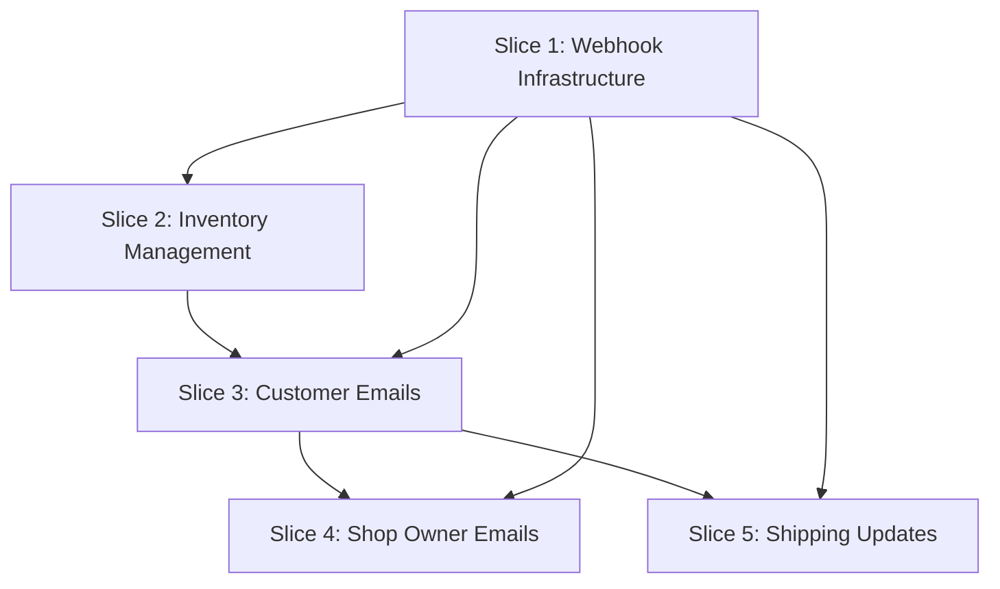

**Gherkin persistence**: features/

# Post-Order Processing System

## Goal

Implement a complete post-order processing system that captures orders in Airtable, sends confirmation emails to customers and shop owners, updates inventory, and provides shipping notification capability.

**Spec**: `docs/specs/post-order-processing.md`

**Strategy**: Build webhook infrastructure first (Slice 1), then parallelize order processing features (Slices 2-4), and finally add shipping updates (Slice 5).

**Decision stances** (per `knowledge/decision-defaults.md`):
- **Integration**: auto-merge (default) - PR opens with auto-merge enabled, lands on green checks
- **Scope**: feature-toggle not applicable - webhook is inactive until registered in Stripe dashboard (natural toggle)

## Acceptance Criteria

From spec - verify at PR review:

- [ ] Customer receives detailed confirmation email within 1 minute of checkout
- [ ] Shop owner receives order notification email at stephenmbrown@gmail.com within 1 minute
- [ ] Order appears in Airtable Orders table within 10 seconds of checkout
- [ ] Inventory quantity decrements by purchased amount immediately after checkout
- [ ] Shop owner can send shipping update via `POST /api/send-shipping-update`
- [ ] Each order processed exactly once (webhook idempotency)
- [ ] Order ID format is `PUP-{last-8-chars-of-stripe-session-id}`
- [ ] Email sender is "Puplets <hello@puplets.co.uk>" or verified domain
- [ ] All error scenarios handled per spec (email failures don't block orders, Airtable failures trigger Stripe retry)

## Slices

### Slice 1: Webhook Infrastructure & Order Capture

**Goal**: Create Stripe webhook endpoint that captures order details in Airtable with idempotency.

**Files**:
- api/webhook-stripe.js (new)
- package.json (modified - add dependencies)

**Depends-on**: none

**Scenarios**:

```gherkin
Feature: Stripe Webhook Order Capture

  Background:
    Given Airtable base is configured with Orders table
    And webhook endpoint is "https://puplets.vercel.app/api/webhook-stripe"

  Scenario: Successful order capture from Stripe webhook
    Given a Stripe checkout session completed with ID "cs_test_a1b2c3d4e5f6g7h8"
    And session contains customer email "customer@example.com"
    And session contains customer name "Jane Smith"
    And session contains shipping address "123 Main St, London SW1A 1AA, UK"
    And session contains line items:
      | description                        | quantity | price |
      | Blue Waterproof Collar - Medium   | 1        | 1999  |
    And session amount_total is 1999
    When Stripe sends "checkout.session.completed" webhook with valid signature
    Then webhook responds with status 200
    And Airtable Orders table contains record with Order ID "PUP-e5f6g7h8"
    And that record has Stripe Session ID "cs_test_a1b2c3d4e5f6g7h8"
    And that record has Customer Email "customer@example.com"
    And that record has Customer Name "Jane Smith"
    And that record has Shipping Address "123 Main St, London SW1A 1AA, UK"
    And that record has Items '[{"description":"Blue Waterproof Collar - Medium","quantity":1,"price":1999}]'
    And that record has Total 19.99
    And that record has Status "pending"
    And that record has Created timestamp within last 10 seconds

  Scenario: Webhook signature validation rejects invalid signature
    Given a Stripe webhook payload with session ID "cs_test_invalid123"
    When webhook receives request with invalid signature
    Then webhook responds with status 401
    And no record is created in Airtable Orders table

  Scenario: Idempotency prevents duplicate order creation
    Given Stripe session "cs_test_a1b2c3d4e5f6g7h8" already processed
    And Airtable Orders table contains record with Order ID "PUP-e5f6g7h8"
    When Stripe sends duplicate "checkout.session.completed" webhook for same session
    Then webhook responds with status 200
    And Airtable Orders table still contains exactly 1 record with Order ID "PUP-e5f6g7h8"
    And that record's Created timestamp has not changed

  Scenario: Airtable API failure triggers Stripe retry
    Given a Stripe checkout session completed with ID "cs_test_xyz789"
    And Airtable API returns 500 error
    When Stripe sends "checkout.session.completed" webhook
    Then webhook responds with status 500
    And error is logged with Stripe session ID "cs_test_xyz789"
```

**Steps**:

1.1. **RED**: Test webhook signature validation rejects invalid Stripe signature
     **GREEN**: Implement `api/webhook-stripe.js` with Stripe signature verification using `STRIPE_WEBHOOK_SECRET`
     **Complexity**: Standard (signature verification, environment variable handling)
     **Files**: api/webhook-stripe.js, tests/webhook-stripe.test.js

1.2. **RED**: Test Order ID generation from Stripe session ID produces `PUP-{last-8-chars}` format
     **GREEN**: Add order ID extraction logic `session.id.slice(-8)` with `PUP-` prefix
     **Complexity**: Trivial (string manipulation)
     **Files**: api/webhook-stripe.js, tests/webhook-stripe.test.js

1.3. **RED**: Test order payload transformation from Stripe session to Airtable record structure
     **GREEN**: Implement transformation function mapping session fields to Airtable schema
     **Complexity**: Standard (data mapping, currency conversion from cents to pounds)
     **Files**: api/webhook-stripe.js, tests/webhook-stripe.test.js

1.4. **RED**: Test Airtable order creation with complete field population
     **GREEN**: Integrate Airtable SDK, implement order creation with all required fields
     **Complexity**: Standard (Airtable API integration, async/await)
     **Files**: api/webhook-stripe.js, tests/webhook-stripe.test.js, package.json

1.5. **RED**: Test idempotency - duplicate webhook does not create second order
     **GREEN**: Implement idempotency check using Stripe session ID lookup before creating order
     **Complexity**: Standard (query Airtable by session ID, conditional creation)
     **Files**: api/webhook-stripe.js, tests/webhook-stripe.test.js

1.6. **RED**: Test Airtable failure returns 500 status and logs error with session ID
     **GREEN**: Add try-catch error handling, log session ID on failure, return appropriate status codes
     **Complexity**: Trivial (error handling, logging)
     **Files**: api/webhook-stripe.js, tests/webhook-stripe.test.js

---

### Slice 2: Inventory Management

**Goal**: Update inventory quantities in Airtable when orders are placed, handling missing products gracefully.

**Files**:
- api/webhook-stripe.js (modified)

**Depends-on**: 1

**Scenarios**:

```gherkin
Feature: Inventory Updates

  Background:
    Given Airtable Inventory table contains:
      | Product                          | SKU       | Quantity |
      | Blue Waterproof Collar - Medium | COL-BLU-M | 10       |
      | Red Waterproof Collar - Small   | COL-RED-S | 5        |

  Scenario: Inventory decrements when order contains matching product
    Given an order contains item "Blue Waterproof Collar - Medium" with quantity 2
    When webhook processes the order
    Then Inventory record with Product "Blue Waterproof Collar - Medium" has Quantity 8
    And that record's Last Updated timestamp is within last 10 seconds

  Scenario: Multiple items update multiple inventory records
    Given an order contains items:
      | description                        | quantity |
      | Blue Waterproof Collar - Medium   | 1        |
      | Red Waterproof Collar - Small     | 2        |
    When webhook processes the order
    Then Inventory record "Blue Waterproof Collar - Medium" has Quantity 9
    And Inventory record "Red Waterproof Collar - Small" has Quantity 3

  Scenario: Missing inventory product does not block order creation
    Given an order contains item "Green Waterproof Collar - Large" with quantity 1
    And Inventory table has no record for "Green Waterproof Collar - Large"
    When webhook processes the order
    Then order is created successfully in Orders table
    And error is logged stating product "Green Waterproof Collar - Large" not found in inventory
    And webhook responds with status 200
```

**Steps**:

2.1. **RED**: Test inventory lookup finds product by description
     **GREEN**: Implement Airtable Inventory query filtering by Product field
     **Complexity**: Standard (Airtable filterByFormula, async query)
     **Files**: api/webhook-stripe.js, tests/webhook-stripe.test.js

2.2. **RED**: Test inventory quantity decrements by purchased amount
     **GREEN**: Calculate new quantity and update Inventory record with Last Updated timestamp
     **Complexity**: Trivial (arithmetic, field update)
     **Files**: api/webhook-stripe.js, tests/webhook-stripe.test.js

2.3. **RED**: Test multiple order items update multiple inventory records
     **GREEN**: Loop through line items, update each matching inventory record
     **Complexity**: Trivial (iteration, multiple updates)
     **Files**: api/webhook-stripe.js, tests/webhook-stripe.test.js

2.4. **RED**: Test missing inventory product logs error but does not fail webhook
     **GREEN**: Add conditional check, log warning on missing product, continue processing
     **Complexity**: Trivial (conditional, logging)
     **Files**: api/webhook-stripe.js, tests/webhook-stripe.test.js

---

### Slice 3: Customer Email Notifications

**Goal**: Send order confirmation emails to customers with complete order details.

**Files**:
- api/webhook-stripe.js (modified)
- package.json (modified - add resend dependency)

**Depends-on**: 1, 2

**Scenarios**:

```gherkin
Feature: Customer Confirmation Emails

  Scenario: Customer receives confirmation email after order creation
    Given order "PUP-a1b2c3d4" was created with:
      | Customer Email   | customer@example.com                  |
      | Customer Name    | Jane Smith                            |
      | Shipping Address | 123 Main St, London SW1A 1AA, UK      |
      | Items            | Blue Waterproof Collar - Medium (1)   |
      | Total            | £19.99                                |
    When webhook processes the order
    Then customer receives email at "customer@example.com" within 60 seconds
    And email subject is "Order Confirmation - Puplets Order PUP-a1b2c3d4"
    And email sender is "Puplets <hello@puplets.co.uk>"
    And email body contains "Order ID: PUP-a1b2c3d4"
    And email body contains itemized list:
      | Product                          | Quantity |
      | Blue Waterproof Collar - Medium | 1        |
    And email body contains "Total: £19.99"
    And email body contains "Shipping Address: 123 Main St, London SW1A 1AA, UK"
    And email body contains "Free delivery in 3-7 business days"

  Scenario: Email failure does not block order creation
    Given an order is being processed
    And Resend API returns error during email send
    When webhook attempts to send customer confirmation
    Then order is created successfully in Airtable
    And error is logged with order ID and "customer confirmation" label
    And webhook responds with status 200
```

**Steps**:

3.1. **RED**: Test email payload generation from order data
     **GREEN**: Create email template function that formats order details into HTML email body
     **Complexity**: Standard (template formatting, data mapping)
     **Files**: api/webhook-stripe.js, tests/webhook-stripe.test.js

3.2. **RED**: Test customer email sends with correct subject, sender, and recipient
     **GREEN**: Integrate Resend SDK, send email with order confirmation content
     **Complexity**: Standard (Resend API integration, async email send)
     **Files**: api/webhook-stripe.js, tests/webhook-stripe.test.js, package.json

3.3. **RED**: Test email failure logs error but returns 200 to Stripe
     **GREEN**: Wrap email send in try-catch, log error, don't propagate to webhook response
     **Complexity**: Trivial (error handling, logging)
     **Files**: api/webhook-stripe.js, tests/webhook-stripe.test.js

---

### Slice 4: Shop Owner Email Notifications

**Goal**: Send order notifications to shop owner with Airtable link to order record.

**Files**:
- api/webhook-stripe.js (modified)

**Depends-on**: 1, 3

**Scenarios**:

```gherkin
Feature: Shop Owner Notifications

  Scenario: Shop owner receives notification for each new order
    Given order "PUP-xyz123" was created in Airtable
    And order has Airtable record ID "recABC123"
    And SHOP_OWNER_EMAIL is "stephenmbrown@gmail.com"
    When webhook processes the order
    Then shop owner receives email at "stephenmbrown@gmail.com" within 60 seconds
    And email subject is "New Order - PUP-xyz123"
    And email body contains customer email "customer@example.com"
    And email body contains customer name "Jane Smith"
    And email body contains full shipping address
    And email body contains itemized products and quantities
    And email body contains total "£19.99"
    And email body contains clickable Airtable link "https://airtable.com/.../recABC123"
```

**Steps**:

4.1. **RED**: Test shop owner email payload includes all order details and Airtable link
     **GREEN**: Create shop owner email template with order summary and Airtable record URL
     **Complexity**: Trivial (template variation, Airtable URL construction)
     **Files**: api/webhook-stripe.js, tests/webhook-stripe.test.js

4.2. **RED**: Test shop owner email sends to SHOP_OWNER_EMAIL environment variable
     **GREEN**: Send email to process.env.SHOP_OWNER_EMAIL with order notification content
     **Complexity**: Trivial (environment variable, email send)
     **Files**: api/webhook-stripe.js, tests/webhook-stripe.test.js

---

### Slice 5: Shipping Updates

**Goal**: Provide endpoint for shop owner to send shipping notifications to customers.

**Files**:
- api/send-shipping-update.js (new)

**Depends-on**: 1, 3

**Scenarios**:

```gherkin
Feature: Shipping Notifications

  Background:
    Given Airtable Orders table contains order with:
      | Order ID         | PUP-a1b2c3d4           |
      | Customer Email   | customer@example.com   |
      | Customer Name    | Jane Smith             |
      | Status           | pending                |

  Scenario: Shop owner sends shipping update with tracking URL
    When shop owner calls "POST /api/send-shipping-update" with:
      | orderId     | PUP-a1b2c3d4                        |
      | trackingUrl | https://track.royalmail.com/123     |
    Then endpoint responds with status 200
    And response body is '{"success": true, "message": "Shipping notification sent"}'
    And customer receives email at "customer@example.com" within 60 seconds
    And email subject is "Your Puplets order has shipped - PUP-a1b2c3d4"
    And email body contains "Your order PUP-a1b2c3d4 has been dispatched"
    And email body contains clickable link "https://track.royalmail.com/123"
    And Orders table record "PUP-a1b2c3d4" has Status "shipped"
    And that record has Tracking URL "https://track.royalmail.com/123"

  Scenario: Shipping update without tracking URL
    When shop owner calls "POST /api/send-shipping-update" with:
      | orderId | PUP-a1b2c3d4 |
    Then endpoint responds with status 200
    And customer receives email stating "Your order has been dispatched"
    And email body does not contain tracking URL
    And Orders table record "PUP-a1b2c3d4" has Status "shipped"
    And that record has no Tracking URL

  Scenario: Non-existent order returns 404
    When shop owner calls "POST /api/send-shipping-update" with:
      | orderId | PUP-nonexistent |
    Then endpoint responds with status 404
    And response body contains error message "Order not found"
    And no email is sent
```

**Steps**:

5.1. **RED**: Test endpoint parses orderId and optional trackingUrl from request body
     **GREEN**: Create `api/send-shipping-update.js`, parse JSON body, extract fields
     **Complexity**: Trivial (body parsing, field extraction)
     **Files**: api/send-shipping-update.js, tests/send-shipping-update.test.js

5.2. **RED**: Test order lookup by Order ID finds existing order
     **GREEN**: Query Airtable Orders table filtering by Order ID field
     **Complexity**: Standard (Airtable query, error handling for not found)
     **Files**: api/send-shipping-update.js, tests/send-shipping-update.test.js

5.3. **RED**: Test non-existent order returns 404 status
     **GREEN**: Return 404 response when order lookup returns no results
     **Complexity**: Trivial (conditional, status code)
     **Files**: api/send-shipping-update.js, tests/send-shipping-update.test.js

5.4. **RED**: Test order status updates to "shipped" in Airtable
     **GREEN**: Update order record Status field to "shipped", set Tracking URL if provided
     **Complexity**: Trivial (Airtable update)
     **Files**: api/send-shipping-update.js, tests/send-shipping-update.test.js

5.5. **RED**: Test shipping notification email sends with tracking URL when provided
     **GREEN**: Send email to customer with shipping template, conditionally include tracking URL
     **Complexity**: Standard (email template, conditional content)
     **Files**: api/send-shipping-update.js, tests/send-shipping-update.test.js

5.6. **RED**: Test shipping notification email sends without tracking URL when omitted
     **GREEN**: Email template omits tracking section when trackingUrl not in request
     **Complexity**: Trivial (conditional template)
     **Files**: api/send-shipping-update.js, tests/send-shipping-update.test.js

5.7. **RED**: Test endpoint returns 200 with success message on completion
     **GREEN**: Return JSON response `{"success": true, "message": "Shipping notification sent"}`
     **Complexity**: Trivial (response formatting)
     **Files**: api/send-shipping-update.js, tests/send-shipping-update.test.js

## Parallelization



| Wave | Slices (parallel) |
|------|-------------------|
| 1    | 1                 |
| 2    | 2                 |
| 3    | 3                 |
| 4    | 4, 5              |

## Pre-PR Gate

Before opening PR:

- [ ] All unit tests pass (`npm test` or equivalent)
- [ ] All BDD scenarios pass (if test infrastructure exists)
- [ ] Webhook signature validation rejects invalid signatures
- [ ] Idempotency prevents duplicate orders
- [ ] Email failures don't block order creation
- [ ] Airtable failures return 500 and trigger Stripe retry
- [ ] Manual test: Complete real Stripe test checkout, verify order in Airtable
- [ ] Manual test: Verify customer and shop owner emails sent
- [ ] Manual test: Call shipping update endpoint, verify email and status update

## Skipped (low value)

None - all spec acceptance criteria are in scope.

## Risks & Open Questions

1. **Airtable account setup**: User has existing Airtable account from years ago - may need to verify it's still accessible and create new base
2. **Resend domain verification**: Email sender "Puplets <hello@puplets.co.uk>" requires domain verification in Resend, or use sandbox during testing
3. **Environment variable setup**: Six environment variables needed in Vercel - coordinate with user to set these up before deployment
4. **Stripe webhook registration**: After deployment, webhook URL must be registered in Stripe dashboard with `checkout.session.completed` event
5. **Initial inventory data**: Airtable Inventory table needs to be manually populated with product list matching Stripe product descriptions before first order
6. **Email template HTML**: Spec doesn't specify HTML vs plain text emails - assume HTML for better formatting, test rendering in common email clients

## Build Progress

#### Wave 1
- [ ] Slice 1: Webhook Infrastructure & Order Capture
  - [ ] Step 1.1: Webhook signature validation
  - [ ] Step 1.2: Order ID generation
  - [ ] Step 1.3: Order payload transformation
  - [ ] Step 1.4: Airtable order creation
  - [ ] Step 1.5: Idempotency check
  - [ ] Step 1.6: Error handling

#### Wave 2
- [ ] Slice 2: Inventory Management
  - [ ] Step 2.1: Inventory lookup
  - [ ] Step 2.2: Quantity decrement
  - [ ] Step 2.3: Multiple items update
  - [ ] Step 2.4: Missing product handling

#### Wave 3
- [ ] Slice 3: Customer Email Notifications
  - [ ] Step 3.1: Email payload generation
  - [ ] Step 3.2: Resend integration
  - [ ] Step 3.3: Email failure handling

#### Wave 4
- [ ] Slice 4: Shop Owner Email Notifications
  - [ ] Step 4.1: Shop owner email template
  - [ ] Step 4.2: Send to SHOP_OWNER_EMAIL

- [ ] Slice 5: Shipping Updates
  - [ ] Step 5.1: Request body parsing
  - [ ] Step 5.2: Order lookup
  - [ ] Step 5.3: 404 handling
  - [ ] Step 5.4: Status update
  - [ ] Step 5.5: Email with tracking
  - [ ] Step 5.6: Email without tracking
  - [ ] Step 5.7: Success response
