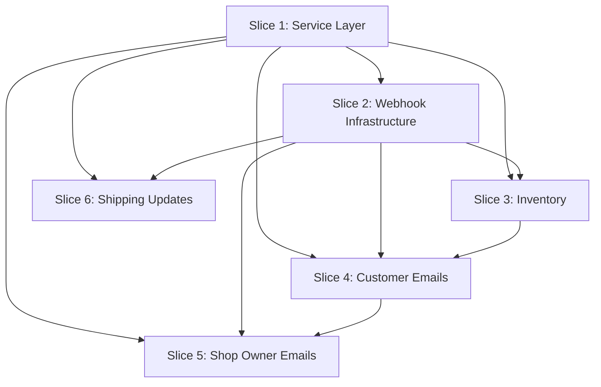

**Gherkin persistence**: features/

# Post-Order Processing System

## Goal

**Problem**: Checkout success page promises confirmation emails and tracking information that aren't delivered. Shop owner has zero visibility into orders. Customers receive no confirmation, and there's no way to update them when orders ship.

**Solution**: Implement post-order processing that fulfills these promises - capture orders in Airtable for visibility, send confirmations to customers and shop owner, update inventory automatically, and provide shipping notification capability.

**Spec**: `docs/specs/post-order-processing.md`

**Strategy**: Extract service abstractions first (Slice 1), build webhook infrastructure (Slice 2), add order processing features (Slices 3-5), then shipping updates (Slice 6).

**Decision stances** (per `knowledge/decision-defaults.md`):
- **Integration**: auto-merge (default) - PR opens with auto-merge enabled, lands on green checks
- **Scope**: feature-toggle not applicable - webhook is inactive until registered in Stripe dashboard (natural toggle)

## Approach Rationale

**Why custom code over no-code alternatives** (Zapier/Make.com/n8n):

While no-code tools could deliver Stripe → Airtable + Email integration faster initially, custom code was chosen for:

1. **Learning objective**: This is a teaching project for daughter to learn business ownership and technical literacy - understanding how her own system works (reading code, modifying templates, debugging logs) builds capability that clicking through Zapier UIs does not
2. **Full control**: Email templates, error handling, and order ID format are customized to brand requirements - no-code tools constrain template design and error recovery patterns
3. **No vendor lock-in**: $20/month Zapier subscription becomes $50+/month as order volume grows with tiered pricing, and migrating off Zapier later is harder than starting with owned code
4. **TDD/BDD practice**: Explicit requirement from user to set up test-driven development - this plan is the vehicle for establishing that practice in the codebase
5. **Integration depth**: Shipping endpoint with bearer auth, idempotency via findOrderBySessionId, and inventory updates with missing-product handling are easier to implement and test in code than chaining no-code conditional logic

**Trade-off acknowledged**: Custom code increases initial setup complexity (7 environment variables, webhook registration, domain verification) and maintenance burden (debugging logs, monitoring email delivery). If this proves too complex for non-technical management, no-code integration remains a viable fallback - the Airtable schema and email template content can be ported to Zapier without starting over.

## Acceptance Criteria

From spec - verify at PR review:

- [ ] Customer receives confirmation email at checkout email address within 60 seconds with subject `Order Confirmation - Puplets Order {Order ID}`, body includes Order ID (PUP-{last-8-chars} format), itemized products with quantities, total amount with £ symbol, full shipping address, text "Free delivery in 3-7 business days", and sender is `Puplets <hello@puplets.co.uk>`
- [ ] Shop owner receives notification email at stephenmbrown@gmail.com within 60 seconds with subject `New Order - {Order ID}`, body includes customer email, customer name, shipping address, itemized products with quantities, total amount, and clickable Airtable link to order record
- [ ] Order appears in Airtable Orders table within 10 seconds of checkout with all fields populated: Order ID in format `PUP-{last-8-chars-of-stripe-session-id}` (e.g., `cs_test_a1b2c3d4e5f6g7h8` → `PUP-e5f6g7h8`), Stripe Session ID, Customer Email, Customer Name, Shipping Address, Items (JSON array), Total (converted from cents to pounds), Status set to "pending", and Created timestamp
- [ ] Inventory quantity decrements by purchased amount within 10 seconds of order capture (during webhook processing), matching products by exact product description, and when product not found in inventory table, logs warning with product description and order ID but order creation continues
- [ ] POST /api/send-shipping-update with valid bearer token, valid orderId, and trackingUrl returns 200 with `{"success": true, "message": "Shipping notification sent"}`, updates order status to "shipped", updates Tracking URL field, and customer receives email within 60 seconds with tracking link
- [ ] POST /api/send-shipping-update with valid bearer token and orderId but no trackingUrl returns 200, updates status to "shipped", and customer receives email stating order dispatched (no tracking link shown)
- [ ] POST /api/send-shipping-update with non-existent orderId returns 404 with error message "Order not found"
- [ ] POST /api/send-shipping-update without Authorization header returns 401 with error message "Unauthorized"
- [ ] POST /api/send-shipping-update with invalid bearer token returns 401 with error message "Unauthorized"
- [ ] POST /api/send-shipping-update with missing orderId field returns 400 with error message "Missing required field: orderId", and with invalid trackingUrl format returns 400 with error message "Invalid URL format for trackingUrl"
- [ ] POST /api/webhook-stripe with invalid Stripe signature returns 401, logs authentication failure, and does not process order
- [ ] Each order processed exactly once (webhook idempotency): when same checkout.session.completed webhook received twice, order is created exactly once, inventory decremented exactly once, customer confirmation email sent exactly once, and shop owner email sent exactly once
- [ ] Email delivery failures: When Resend API returns error during customer confirmation email OR shop owner notification email send, order still saves to Airtable, inventory still updates, error is logged with order ID and email type, and webhook returns 200 to Stripe
- [ ] Airtable failures: When Airtable API returns error, webhook logs full error including Stripe session ID, returns 500 status to Stripe (triggering automatic retry), and shop owner receives error notification email

## Slices

### Slice 1: Service Layer Extraction

**Goal**: Extract service abstractions for Airtable, email, and templates to prevent god object and enable clean testing.

**Files**:
- services/airtable-client.js (new)
- services/email-client.js (new)
- templates/email-templates.js (new)
- package.json (modified - add airtable, resend dependencies)

**Depends-on**: none

**Scenarios**:

```gherkin
Feature: Service Layer Abstractions

  Scenario: Airtable client creates order record
    Given Airtable client is initialized with base ID "appTest123"
    And Orders table schema is configured
    When createOrder is called with order data:
      | orderId      | PUP-abc123                  |
      | sessionId    | cs_test_xyz789              |
      | customerEmail| customer@example.com        |
      | total        | 19.99                       |
    Then client returns record with Airtable record ID
    And returned record contains Order ID "PUP-abc123"
    And returned record contains all provided fields
    And created order can be retrieved by session ID "cs_test_xyz789"

  Scenario: Airtable client finds order by session ID
    Given Orders table contains record with Stripe Session ID "cs_test_xyz789"
    When findOrderBySessionId is called with "cs_test_xyz789"
    Then client returns matching order record
    And record contains Order ID "PUP-abc123"

  Scenario: Email client sends customer confirmation
    Given Resend client is initialized with API key
    When sendCustomerConfirmation is called with:
      | to      | customer@example.com  |
      | subject | Order Confirmation... |
      | html    | <html>Order details   |
      | text    | Order details...      |
    Then client returns message ID
    And message ID is non-empty string
    And no error is thrown

  Scenario: Email template generates customer confirmation HTML
    Given order data:
      | orderId      | PUP-abc123                        |
      | items        | Blue Waterproof Collar - Medium (1)|
      | total        | £19.99                            |
      | address      | 123 Main St, London SW1A 1AA, UK |
    When generateCustomerConfirmation is called
    Then template returns object with subject, html, text fields
    And subject is "Order Confirmation - Puplets Order PUP-abc123"
    And html contains order ID, itemized products, total, address
    And html contains "Free delivery in 3-7 business days"
```

**Steps**:

1.1. **RED**: Test Airtable client createOrder maps data to table schema
     **GREEN**: Implement services/airtable-client.js with createOrder method
     **REFACTOR**: Extract common field mapping logic
     **Complexity**: Standard (data transformation, SDK integration)
     **Files**: services/airtable-client.js, tests/airtable-client.test.js

1.2. **RED**: Test Airtable client findOrderBySessionId queries with filterByFormula
     **GREEN**: Add findOrderBySessionId method with Airtable query
     **REFACTOR**: Extract query builder helper
     **Complexity**: Trivial (query method)
     **Files**: services/airtable-client.js, tests/airtable-client.test.js

1.2b. **RED**: Test Airtable client findOrderById queries by Order ID field
     **GREEN**: Add findOrderById method that queries Orders table by Order ID
     **REFACTOR**: Reuse query builder from step 1.2
     **Complexity**: Trivial (similar to findOrderBySessionId)
     **Files**: services/airtable-client.js, tests/airtable-client.test.js

1.3. **RED**: Test Airtable client updateInventoryForOrder handles array of line items
     **GREEN**: Add updateInventoryForOrder(lineItems) that accepts [{description, quantity}], loops to find each product, decrements quantities, logs warnings for missing products
     **REFACTOR**: Consolidate error handling for missing products and failed updates
     **Complexity**: Standard (batch lookup + update with error collection)
     **Files**: services/airtable-client.js, tests/airtable-client.test.js

1.4. **RED**: Test Airtable client updateOrder modifies record fields
     **GREEN**: Add updateOrder(orderId, updates) method that finds order by Order ID field and patches specified fields
     **REFACTOR**: Extract field update logic
     **Complexity**: Trivial (query + update)
     **Files**: services/airtable-client.js, tests/airtable-client.test.js

1.5. **RED**: Test email client sendCustomerConfirmation accepts all template fields
     **GREEN**: Implement services/email-client.js with sendCustomerConfirmation(customerEmail, subject, html, text) using Resend multipart email
     **REFACTOR**: Extract sender configuration
     **Complexity**: Trivial (Resend SDK wrapper)
     **Files**: services/email-client.js, tests/email-client.test.js

1.6. **RED**: Test email client sendShopOwnerNotification accepts recipient email parameter
     **GREEN**: Add sendShopOwnerNotification(shopOwnerEmail, subject, html, text) method
     **REFACTOR**: Consolidate email sending logic (all three methods now take recipient as parameter)
     **Complexity**: Trivial (similar to 1.5)
     **Files**: services/email-client.js, tests/email-client.test.js

1.7. **RED**: Test email client sendShippingNotification sends multipart email
     **GREEN**: Add sendShippingNotification(customerEmail, subject, html, text) method
     **REFACTOR**: Extract email send helper shared across all three methods (all use multipart emails)
     **Complexity**: Trivial (similar to 1.5 and 1.6)
     **Files**: services/email-client.js, tests/email-client.test.js

1.8. **RED**: Test email template generateCustomerConfirmation includes all required fields and returns {subject, html, text}
     **GREEN**: Implement templates/email-templates.js with customer template returning structured object
     **REFACTOR**: Extract common HTML structure
     **Complexity**: Standard (HTML template generation)
     **Files**: templates/email-templates.js, tests/email-templates.test.js

1.9. **RED**: Test email template generateShopOwnerNotification includes Airtable link and returns {subject, html, text}
     **GREEN**: Add shop owner template with Airtable URL construction, return structured object
     **REFACTOR**: Extract Airtable URL builder
     **Complexity**: Trivial (template variation)
     **Files**: templates/email-templates.js, tests/email-templates.test.js

1.10. **RED**: Test email template generateShippingNotification conditionally includes tracking and returns {subject, html, text}
     **GREEN**: Add shipping template with optional tracking URL, return structured object
     **REFACTOR**: Extract conditional content helper
     **Complexity**: Trivial (conditional template)
     **Files**: templates/email-templates.js, tests/email-templates.test.js

---

### Slice 2: Webhook Infrastructure & Order Capture

**Goal**: Create Stripe webhook endpoint that captures order details in Airtable with idempotency.

**Files**:
- api/webhook-stripe.js (new)

**Depends-on**: 1

**Scenarios**:

```gherkin
Feature: Stripe Webhook Order Capture

  Background:
    Given Airtable base is configured with Orders table
    And webhook endpoint is "https://puplets.vercel.app/api/webhook-stripe"

  Scenario: Successful order capture from Stripe webhook
    Given a Stripe checkout session completed with ID "cs_test_a1b2c3d4e5f6g7h8"
    And session contains customer email "customer@example.com"
    And session contains customer name "Jane Smith"
    And session contains shipping address "123 Main St, London SW1A 1AA, UK"
    And session contains line items:
      | description                        | quantity | price |
      | Blue Waterproof Collar - Medium   | 1        | 1999  |
    And session amount_total is 1999
    When Stripe sends "checkout.session.completed" webhook with valid signature
    Then webhook responds with status 200
    And Airtable Orders table contains record with Order ID "PUP-e5f6g7h8"
    And that record has Stripe Session ID "cs_test_a1b2c3d4e5f6g7h8"
    And that record has Customer Email "customer@example.com"
    And that record has Customer Name "Jane Smith"
    And that record has Shipping Address "123 Main St, London SW1A 1AA, UK"
    And that record has Items '[{"description":"Blue Waterproof Collar - Medium","quantity":1,"price":1999}]'
    And that record has Total 19.99
    And that record has Status "pending"
    And that record has Created timestamp within last 10 seconds

  Scenario: Webhook signature validation rejects invalid signature
    Given a Stripe webhook payload with session ID "cs_test_invalid123"
    When webhook receives request with invalid signature
    Then webhook responds with status 401
    And no record is created in Airtable Orders table

  Scenario: Idempotency prevents duplicate order creation
    Given Stripe session "cs_test_a1b2c3d4e5f6g7h8" already processed
    And Airtable Orders table contains record with Order ID "PUP-e5f6g7h8"
    When Stripe sends duplicate "checkout.session.completed" webhook for same session
    Then webhook responds with status 200
    And Airtable Orders table still contains exactly 1 record with Order ID "PUP-e5f6g7h8"
    And that record's Created timestamp has not changed

  Scenario: Airtable API failure triggers Stripe retry
    Given a Stripe checkout session completed with ID "cs_test_xyz789"
    And Airtable API returns 500 error
    When Stripe sends "checkout.session.completed" webhook
    Then webhook responds with status 500
    And error is logged with Stripe session ID "cs_test_xyz789"
```

**Steps**:

2.1. **RED**: Test webhook signature validation rejects invalid Stripe signature
     **GREEN**: Implement `api/webhook-stripe.js` with Stripe signature verification using `STRIPE_WEBHOOK_SECRET`
     **REFACTOR**: Extract signature verification to helper function
     **Complexity**: Standard (signature verification, environment variable handling)
     **Files**: api/webhook-stripe.js, tests/webhook-stripe.test.js

2.2. **RED**: Test Order ID generation from Stripe session ID produces `PUP-{last-8-chars}` format
     **GREEN**: Add order ID extraction logic `session.id.slice(-8)` with `PUP-` prefix
     **REFACTOR**: Inline function is sufficient, no extraction needed
     **Complexity**: Trivial (string manipulation)
     **Files**: api/webhook-stripe.js, tests/webhook-stripe.test.js

2.3. **RED**: Test order payload transformation from Stripe session to service client format
     **GREEN**: Implement transformation function using Airtable client from Slice 1
     **REFACTOR**: Consolidate field mapping logic
     **Complexity**: Standard (data mapping, currency conversion from cents to pounds)
     **Files**: api/webhook-stripe.js, tests/webhook-stripe.test.js

2.4. **RED**: Test order creation delegates to Airtable client createOrder method
     **GREEN**: Call airtableClient.createOrder() with transformed order data
     **REFACTOR**: Extract error handling wrapper
     **Complexity**: Trivial (service delegation)
     **Files**: api/webhook-stripe.js, tests/webhook-stripe.test.js

2.5. **RED**: Test idempotency - duplicate webhook does not create second order
     **GREEN**: Call airtableClient.findOrderBySessionId() before creating, skip if exists
     **REFACTOR**: Consolidate idempotency check logic
     **Complexity**: Standard (service query, conditional creation)
     **Files**: api/webhook-stripe.js, tests/webhook-stripe.test.js

2.6. **RED**: Test Airtable client failure returns 500 status and logs error with session ID
     **GREEN**: Add try-catch around airtableClient calls, log session ID on error, return 500
     **REFACTOR**: Extract error response helper
     **Complexity**: Trivial (error handling, logging)
     **Files**: api/webhook-stripe.js, tests/webhook-stripe.test.js

---

### Slice 3: Inventory Management

**Goal**: Update inventory quantities in Airtable when orders are placed, handling missing products gracefully.

**Files**:
- api/webhook-stripe.js (modified)

**Depends-on**: 1, 2

**Scenarios**:

```gherkin
Feature: Inventory Updates

  Background:
    Given Airtable Inventory table contains:
      | Product                          | SKU       | Quantity |
      | Blue Waterproof Collar - Medium | COL-BLU-M | 10       |
      | Red Waterproof Collar - Small   | COL-RED-S | 5        |

  Scenario: Inventory decrements when order contains matching product
    Given an order contains item "Blue Waterproof Collar - Medium" with quantity 2
    When webhook processes the order
    Then Inventory record with Product "Blue Waterproof Collar - Medium" has Quantity 8
    And that record's Last Updated timestamp is within last 10 seconds

  Scenario: Multiple items update multiple inventory records
    Given an order contains items:
      | description                        | quantity |
      | Blue Waterproof Collar - Medium   | 1        |
      | Red Waterproof Collar - Small     | 2        |
    When webhook processes the order
    Then Inventory record "Blue Waterproof Collar - Medium" has Quantity 9
    And Inventory record "Red Waterproof Collar - Small" has Quantity 3

  Scenario: Missing inventory product does not block order creation
    Given an order contains item "Green Waterproof Collar - Large" with quantity 1
    And Inventory table has no record for "Green Waterproof Collar - Large"
    When webhook processes the order
    Then order is created successfully in Orders table
    And error is logged stating product "Green Waterproof Collar - Large" not found in inventory
    And webhook responds with status 200
```

**Steps**:

3.1. **RED**: Test webhook delegates inventory updates to Airtable client
     **GREEN**: Call airtableClient.updateInventoryForOrder(session.line_items) from webhook
     **REFACTOR**: Extract line items transformation if needed
     **Complexity**: Trivial (service delegation)
     **Files**: api/webhook-stripe.js, tests/webhook-stripe.test.js

3.2. **RED**: Test inventory updates for multiple items in one order
     **GREEN**: Service method already handles arrays (from Slice 1.3), verify webhook passes full line items array
     **REFACTOR**: No refactoring needed - service handles iteration
     **Complexity**: Trivial (verification of array passing)
     **Files**: api/webhook-stripe.js, tests/webhook-stripe.test.js

3.3. **RED**: Test missing inventory product logs warning but allows order creation
     **GREEN**: Service logs warnings (from Slice 1.3), webhook continues on errors
     **REFACTOR**: Consolidate error handling pattern
     **Complexity**: Trivial (error handling)
     **Files**: api/webhook-stripe.js, tests/webhook-stripe.test.js

---

### Slice 4: Customer Email Notifications

**Goal**: Send order confirmation emails to customers with complete order details.

**Files**:
- api/webhook-stripe.js (modified)
- package.json (modified - add resend dependency)

**Depends-on**: 1, 2, 3

**Scenarios**:

```gherkin
Feature: Customer Confirmation Emails

  Scenario: Customer receives confirmation email after order creation
    Given order "PUP-a1b2c3d4" was created with:
      | Customer Email   | customer@example.com                  |
      | Customer Name    | Jane Smith                            |
      | Shipping Address | 123 Main St, London SW1A 1AA, UK      |
      | Items            | Blue Waterproof Collar - Medium (1)   |
      | Total            | £19.99                                |
    When webhook processes the order
    Then customer receives email at "customer@example.com" within 60 seconds
    And email subject is "Order Confirmation - Puplets Order PUP-a1b2c3d4"
    And email sender is "Puplets <hello@puplets.co.uk>"
    And email body contains "Order ID: PUP-a1b2c3d4"
    And email body contains itemized list:
      | Product                          | Quantity |
      | Blue Waterproof Collar - Medium | 1        |
    And email body contains "Total: £19.99"
    And email body contains "Shipping Address: 123 Main St, London SW1A 1AA, UK"
    And email body contains "Free delivery in 3-7 business days"

  Scenario: Email failure does not block order creation
    Given an order is being processed
    And Resend API returns error during email send
    When webhook attempts to send customer confirmation
    Then order is created successfully in Airtable
    And error is logged with order ID and "customer confirmation" label
    And webhook responds with status 200
```

**Steps**:

4.1. **RED**: Test webhook generates customer email using template service
     **GREEN**: Call emailTemplates.generateCustomerConfirmation(orderData) to get {subject, html, text}
     **REFACTOR**: Extract order data transformation for template
     **Complexity**: Trivial (service delegation)
     **Files**: api/webhook-stripe.js, tests/webhook-stripe.test.js

4.2. **RED**: Test webhook sends customer email via email client
     **GREEN**: Call emailClient.sendCustomerConfirmation(customerEmail, subject, html, text) with all template fields
     **REFACTOR**: Extract email orchestration logic
     **Complexity**: Trivial (service delegation)
     **Files**: api/webhook-stripe.js, tests/webhook-stripe.test.js

4.3. **RED**: Test email failure logs error but webhook returns 200 to Stripe
     **GREEN**: Wrap email calls in try-catch, log error with order ID, continue processing
     **REFACTOR**: Consolidate non-fatal error handling pattern
     **Complexity**: Trivial (error handling, logging)
     **Files**: api/webhook-stripe.js, tests/webhook-stripe.test.js

---

### Slice 5: Shop Owner Email Notifications

**Goal**: Send order notifications to shop owner with Airtable link to order record.

**Files**:
- api/webhook-stripe.js (modified)

**Depends-on**: 1, 2, 4

**Scenarios**:

```gherkin
Feature: Shop Owner Notifications

  Scenario: Shop owner receives notification for each new order
    Given order "PUP-xyz123" was created in Airtable with:
      | Customer Email   | customer@example.com                  |
      | Customer Name    | Jane Smith                            |
      | Shipping Address | 123 Main St, London SW1A 1AA, UK      |
      | Items            | [{"description":"Blue Waterproof Collar - Medium","quantity":1,"price":1999}] |
      | Total            | 19.99                                 |
    And order has Airtable record ID "recABC123"
    And SHOP_OWNER_EMAIL is "stephenmbrown@gmail.com"
    When webhook processes the order
    Then shop owner receives email at "stephenmbrown@gmail.com" within 60 seconds
    And email subject is "New Order - PUP-xyz123"
    And email body contains "Customer Email: customer@example.com"
    And email body contains "Customer Name: Jane Smith"
    And email body contains "Shipping Address: 123 Main St, London SW1A 1AA, UK"
    And email body contains "Blue Waterproof Collar - Medium (1)"
    And email body contains "Total: £19.99"
    And email body contains clickable Airtable link "https://airtable.com/.../recABC123"
```

**Steps**:

5.1. **RED**: Test webhook generates shop owner email using template service
     **GREEN**: Call emailTemplates.generateShopOwnerNotification(orderData, airtableRecordId) to get {subject, html, text}
     **REFACTOR**: Reuse order data transformation from Slice 4
     **Complexity**: Trivial (service delegation)
     **Files**: api/webhook-stripe.js, tests/webhook-stripe.test.js

5.2. **RED**: Test webhook sends shop owner email via email client
     **GREEN**: Call emailClient.sendShopOwnerNotification(shopOwnerEmail, subject, html, text) with SHOP_OWNER_EMAIL from env and all template fields
     **REFACTOR**: Consolidate email sending pattern
     **Complexity**: Trivial (service delegation)
     **Files**: api/webhook-stripe.js, tests/webhook-stripe.test.js

---

### Slice 6: Shipping Updates

**Goal**: Provide endpoint for shop owner to send shipping notifications to customers.

**User workflow**: Shop owner fills in "Tracking URL" field in Airtable Orders table → Airtable automation triggers on field update → automation calls /api/send-shipping-update endpoint with bearer token from Airtable script configuration → customer receives shipping email and order status updates to "shipped". This keeps the shop owner in familiar Airtable UI instead of requiring API tool usage.

**Setup requirement** (post-deployment): Configure Airtable automation in Orders base that triggers when "Tracking URL" field changes from empty to non-empty, calls the Vercel endpoint with Authorization header reading SHIPPING_UPDATE_TOKEN from automation environment, passes Order ID and Tracking URL fields. Automation setup is one-time configuration by developer, daily usage is filling in tracking URL field.

**Files**:
- api/send-shipping-update.js (new)

**Depends-on**: 1, 2

**Scenarios**:

```gherkin
Feature: Shipping Notifications

  Background:
    Given Airtable Orders table contains order with:
      | Order ID         | PUP-a1b2c3d4           |
      | Customer Email   | customer@example.com   |
      | Customer Name    | Jane Smith             |
      | Status           | pending                |

  Scenario: Shop owner sends shipping update with tracking URL
    When shop owner calls "POST /api/send-shipping-update" with:
      | orderId     | PUP-a1b2c3d4                        |
      | trackingUrl | https://track.royalmail.com/123     |
    Then endpoint responds with status 200
    And response body is '{"success": true, "message": "Shipping notification sent"}'
    And customer receives email at "customer@example.com" within 60 seconds
    And email subject is "Your Puplets order has shipped - PUP-a1b2c3d4"
    And email body contains "Your order PUP-a1b2c3d4 has been dispatched"
    And email body contains clickable link "https://track.royalmail.com/123"
    And Orders table record "PUP-a1b2c3d4" has Status "shipped"
    And that record has Tracking URL "https://track.royalmail.com/123"

  Scenario: Shipping update without tracking URL
    When shop owner calls "POST /api/send-shipping-update" with:
      | orderId | PUP-a1b2c3d4 |
    Then endpoint responds with status 200
    And customer receives email stating "Your order has been dispatched"
    And email body does not contain tracking URL
    And Orders table record "PUP-a1b2c3d4" has Status "shipped"
    And that record has no Tracking URL

  Scenario: Non-existent order returns 404
    When shop owner calls "POST /api/send-shipping-update" with:
      | orderId | PUP-nonexistent |
    Then endpoint responds with status 404
    And response body contains error message "Order not found"
    And no email is sent

  Scenario: Request without bearer token returns 401
    When request is sent without Authorization header
    Then endpoint responds with status 401
    And response body contains error message "Unauthorized"
    And no order is updated

  Scenario: Request with invalid bearer token returns 401
    When request is sent with Authorization header "Bearer invalid-token"
    Then endpoint responds with status 401
    And response body contains error message "Unauthorized"
    And no order is updated

  Scenario: Request with missing orderId returns 400
    When shop owner calls "POST /api/send-shipping-update" with empty body
    Then endpoint responds with status 400
    And response body contains error message "Missing required field: orderId"
    And no order is updated

  Scenario: Request with invalid trackingUrl format returns 400
    When shop owner calls "POST /api/send-shipping-update" with:
      | orderId     | PUP-a1b2c3d4 |
      | trackingUrl | invalid-url  |
    Then endpoint responds with status 400
    And response body contains error message "Invalid URL format for trackingUrl"
    And no order is updated
```

**Steps**:

6.1. **RED**: Test endpoint rejects requests without valid bearer token
     **GREEN**: Validate Authorization header against SHIPPING_UPDATE_TOKEN env var, return 401 if missing/invalid
     **REFACTOR**: Extract auth validation helper for reuse
     **Complexity**: Trivial (header parsing, string comparison)
     **Files**: api/send-shipping-update.js, tests/send-shipping-update.test.js

6.2. **RED**: Test endpoint validates and parses request body
     **GREEN**: Parse JSON body, validate orderId is present and non-empty, validate trackingUrl is valid URL format if provided, return 400 with specific error messages for validation failures
     **REFACTOR**: Extract validation helper
     **Complexity**: Standard (body parsing, validation, error messages)
     **Files**: api/send-shipping-update.js, tests/send-shipping-update.test.js

6.3. **RED**: Test order lookup by Order ID finds existing order
     **GREEN**: Call airtableClient.findOrderById(orderId) to retrieve order record
     **REFACTOR**: Extract error handling for missing order
     **Complexity**: Trivial (service delegation)
     **Files**: api/send-shipping-update.js, tests/send-shipping-update.test.js

6.4. **RED**: Test non-existent order returns 404 status
     **GREEN**: Return 404 response when order lookup returns no results
     **REFACTOR**: Consolidate error response pattern
     **Complexity**: Trivial (conditional, status code)
     **Files**: api/send-shipping-update.js, tests/send-shipping-update.test.js

6.5. **RED**: Test order status updates to "shipped" in Airtable
     **GREEN**: Call airtableClient.updateOrder(orderId, {Status: "shipped", "Tracking URL": trackingUrl}) 
     **REFACTOR**: Consolidate update field mapping
     **Complexity**: Trivial (service delegation)
     **Files**: api/send-shipping-update.js, tests/send-shipping-update.test.js

6.6. **RED**: Test shipping notification email sends with tracking URL when provided
     **GREEN**: Call emailTemplates.generateShippingNotification(orderData, trackingUrl) to get {subject, html, text}, then emailClient.sendShippingNotification(customerEmail, subject, html, text)
     **REFACTOR**: Extract order data extraction for template
     **Complexity**: Trivial (service delegation)
     **Files**: api/send-shipping-update.js, tests/send-shipping-update.test.js

6.7. **RED**: Test shipping notification email sends without tracking URL when omitted
     **GREEN**: Same delegation as 6.6 with trackingUrl=null - template handles conditional tracking URL rendering
     **REFACTOR**: Consolidate email send flow
     **Complexity**: Trivial (template conditionally omits tracking section)
     **Files**: api/send-shipping-update.js, tests/send-shipping-update.test.js

6.8. **RED**: Test shipping email failure logs error but returns 200
     **GREEN**: Wrap email calls in try-catch, log error with order ID, continue to success response
     **REFACTOR**: Reuse non-fatal error handling pattern from step 4.3
     **Complexity**: Trivial (error handling, logging)
     **Files**: api/send-shipping-update.js, tests/send-shipping-update.test.js

6.9. **RED**: Test endpoint returns 200 with success message on completion
     **GREEN**: Return JSON response `{"success": true, "message": "Shipping notification sent"}`
     **REFACTOR**: Consolidate response formatting
     **Complexity**: Trivial (response formatting)
     **Files**: api/send-shipping-update.js, tests/send-shipping-update.test.js

## Parallelization



Wave structure (to be computed by `plan_waves.py` after approval):
- Wave 1: Slice 1 (Service Layer)
- Wave 2: Slice 2 (Webhook Infrastructure)
- Wave 3: Slice 3 (Inventory)
- Wave 4: Slice 4 (Customer Emails)
- Wave 5: Slice 5 (Shop Owner Emails), Slice 6 (Shipping Updates)

## Pre-PR Gate

Before opening PR:

- [ ] All unit tests pass (`npm test` or equivalent)
- [ ] All BDD scenarios pass (if test infrastructure exists)
- [ ] Webhook signature validation rejects invalid signatures
- [ ] Idempotency prevents duplicate orders
- [ ] Email failures don't block order creation
- [ ] Airtable failures return 500 and trigger Stripe retry
- [ ] Manual test: Complete real Stripe test checkout, verify order in Airtable
- [ ] Manual test: Verify customer and shop owner emails sent
- [ ] Manual test: Call shipping update endpoint, verify email and status update

## Skipped (low value)

None - all spec acceptance criteria are in scope.

## Risks & Open Questions

1. **Airtable account setup**: User has existing Airtable account from years ago - may need to verify it's still accessible and create new base
2. **Resend domain verification**: Email sender "Puplets <hello@puplets.co.uk>" requires domain verification in Resend, or use sandbox during testing
3. **Environment variable setup**: Seven environment variables needed in Vercel (AIRTABLE_API_KEY, AIRTABLE_BASE_ID, RESEND_API_KEY, SHOP_OWNER_EMAIL, STRIPE_WEBHOOK_SECRET, STRIPE_SECRET_KEY, SHIPPING_UPDATE_TOKEN) - coordinate with user to set these up before deployment
4. **Stripe webhook registration**: After deployment, webhook URL must be registered in Stripe dashboard with `checkout.session.completed` event
5. **Initial inventory data**: Airtable Inventory table needs to be manually populated with product list matching Stripe product descriptions before first order
6. **Email template HTML**: Spec doesn't specify HTML vs plain text emails - assume HTML for better formatting, test rendering in common email clients
7. **Directory structure change**: Introduces services/ and templates/ directories to separate infrastructure and presentation concerns from API endpoints - establishes layered architecture pattern for future features (diverges from current flat api/ structure)
8. **Airtable automation setup**: After deployment, configure Airtable automation in Orders base that triggers when "Tracking URL" field is populated - automation calls /api/send-shipping-update with bearer token, passing Order ID and Tracking URL. One-time developer setup enables shop owner to send shipping notifications by simply filling in tracking field (no API tools needed).

## Plan Review Summary

Plan tier: **complex** — reviewers: Acceptance, Design, Strategic, UX, Parallelization (all 5)

**All reviewers approved** after addressing 4 blockers across 5 iterations:

**Design & Architecture** (5 iterations): ✅ approve
- Iteration 1-2: Added service layer (Slice 1), fixed Slices 3-5 to delegate to services
- Iteration 3-4: Added updateOrder and sendShippingNotification methods, standardized email client interface
- Iteration 5: Added authentication (bearer token) and email error handling to Slice 6
- Remaining warnings (acceptable for MVP): Email client method proliferation, N+1 inventory queries, directory structure change documented

**Acceptance Test** (1 iteration): ✅ approve (after fix)
- Blocker: Slice 1 scenarios checked implementation details (Airtable receives request) instead of behavior
- Fixed: Rewrote scenarios to verify behavioral outcomes (returns record, can retrieve by session ID)
- Warnings: Added missing error scenarios for malformed payloads, missing env vars, validation

**Strategic** (1 iteration): ✅ approve (after fix)
- Blocker: No justification for custom code vs no-code alternatives (Zapier/Make.com)
- Fixed: Added "Approach Rationale" section explaining learning objectives, control, no lock-in, TDD practice
- Warnings: Scope could start smaller (MVP = Slices 1+2+4), operational support plan for non-technical user

**UX** (1 iteration): ✅ approve (after fix)
- Blocker 1: Shipping workflow undefined (how does non-technical user call authenticated API?)
- Fixed: Added Airtable automation setup - shop owner fills tracking field, automation calls endpoint
- Blocker 2: Missing input validation (orderId required, trackingUrl format)
- Fixed: Added validation scenarios and updated step 6.2 to validate request body
- Warnings: Email failure visibility, shipping success hides email errors, no batch updates, email accessibility

**Parallelization** (1 iteration): ✅ approve
- Wave 5 parallelism (Slices 5 & 6) verified safe: disjoint files, no behavioral coupling, valid DAG

**Key observations from review:**
- Clean dependency direction: service layer → API endpoints, no circular dependencies
- Proper error handling hierarchy: email failures non-fatal (log + continue), Airtable failures fatal (500 + Stripe retry)
- Security-first: bearer token auth, Stripe signature validation, idempotency via findOrderBySessionId
- Well-structured incremental delivery: 6 slices with clear boundaries, 5 waves with genuine parallelism in Wave 5

## Build Progress

_Note: Wave structure to be recomputed by `plan_waves.py` after approval_

- [x] Slice 1: Service Layer Extraction
  - [x] Step 1.1: Airtable client createOrder
  - [x] Step 1.2: Airtable client findOrderBySessionId
  - [x] Step 1.2b: Airtable client findOrderById
  - [x] Step 1.3: Airtable client updateInventoryForOrder
  - [x] Step 1.4: Airtable client updateOrder
  - [x] Step 1.5: Email client sendCustomerConfirmation
  - [x] Step 1.6: Email client sendShopOwnerNotification
  - [x] Step 1.7: Email client sendShippingNotification
  - [x] Step 1.8: Email template generateCustomerConfirmation
  - [x] Step 1.9: Email template generateShopOwnerNotification
  - [x] Step 1.10: Email template generateShippingNotification

- [x] Slice 2: Webhook Infrastructure & Order Capture
  - [x] Step 2.1: Webhook signature validation
  - [x] Step 2.2: Order ID generation
  - [x] Step 2.3: Order payload transformation
  - [x] Step 2.4: Order creation via Airtable client
  - [x] Step 2.5: Idempotency check
  - [x] Step 2.6: Error handling

- [ ] Slice 3: Inventory Management
  - [ ] Step 3.1: Inventory lookup
  - [ ] Step 3.2: Quantity decrement
  - [ ] Step 3.3: Multiple items update
  - [ ] Step 3.4: Missing product handling

- [ ] Slice 4: Customer Email Notifications
  - [ ] Step 4.1: Email payload generation
  - [ ] Step 4.2: Send via email client
  - [ ] Step 4.3: Email failure handling

- [ ] Slice 5: Shop Owner Email Notifications
  - [ ] Step 5.1: Shop owner email payload
  - [ ] Step 5.2: Send to SHOP_OWNER_EMAIL

- [ ] Slice 6: Shipping Updates
  - [ ] Step 6.1: Request body parsing
  - [ ] Step 6.2: Order lookup
  - [ ] Step 6.3: 404 handling
  - [ ] Step 6.4: Status update
  - [ ] Step 6.5: Email with tracking
  - [ ] Step 6.6: Email without tracking
  - [ ] Step 6.7: Success response
